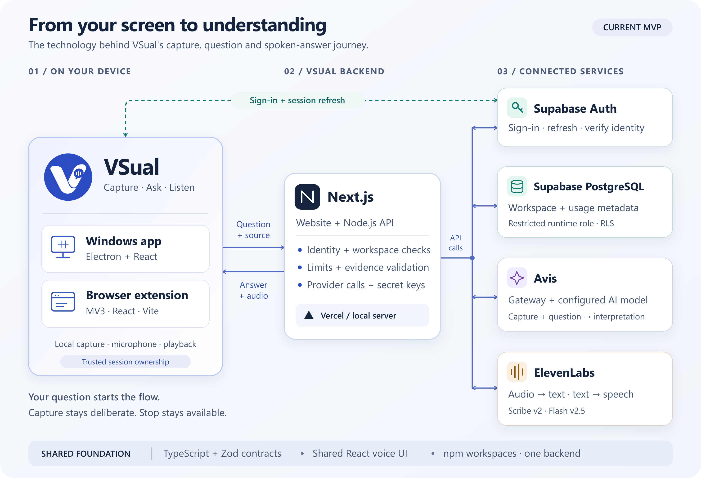

# VSual

**Ask about your screen. Hear an explanation. Explore what matters next.**

VSual (pronounced **“Visual”**) is an accessibility companion for blind and
low-vision people working with digital information. It combines deliberate screen
capture, spoken or typed questions, and answers with inspectable evidence.

Built for **RMIT ADC Hackathon 2026**, VSual addresses the **Visual Impairment**
focus area under the **AI & Employability** theme: using AI to make workplace
information more accessible. [About the competition](https://industryhub.rmit.edu.vn/ADC/)

## The problem

A workplace task can depend on information presented visually: a chart in a
meeting, a screenshot in a document, a pricing comparison, or a dense application
view. When that information lacks useful accessible descriptions, understanding
its meaning and relationships can require extra effort or help from a colleague.

Screen readers already provide essential access to well-structured content. VSual
complements them by helping users ask contextual questions about visual material
and inspect the source behind an explanation. The goal is greater independence
in everyday knowledge work, with the user choosing what to ask and when to stop.

## The product

The current MVP is a **Windows desktop companion**, with a browser extension also
available in this repository. The desktop app captures the selected application's
current view when a question is submitted. It uses a cloud model to explain that
capture, then presents readable evidence and speaks the answer.

| Capability            | What the user can do                                                                           |
| --------------------- | ---------------------------------------------------------------------------------------------- |
| Accessible activation | Use a configurable Talk shortcut to target the active application and begin a question.        |
| Voice or text         | Speak in English or Vietnamese, review a transcript, or type a question.                       |
| Screen understanding  | Ask for a summary, an explanation, or details supported by the captured view.                  |
| Answers with evidence | Read the answer and inspect its referenced screenshot regions.                                 |
| Spoken replies        | Hear answers at 0.9× speed, stop immediately, and repeat cached audio.                         |
| Follow-up guidance    | Choose from up to three supported follow-up questions, or ask another question.                |
| Keyboard access       | Navigate labelled controls, visible focus, instructions and hotkeys without requiring a mouse. |

Example questions include **“What are the main points on this screen?”**,
**“What does this pricing option include?”**, and **“Giải thích nội dung trên màn
hình này.”** English and Vietnamese output are supported; pronunciation quality
still depends on the configured voice.

### A typical desktop journey

1. **Sign in** with an existing VSual-enabled account and workspace access.
2. **Switch to the application** you want to understand. Press the Talk shortcut
   (default **Ctrl + Alt + Space**) and wait for the listening cue.
3. **Ask your question.** After speech, five seconds of silence submits it;
   speaking again resets the countdown. Use **Stop and review** to edit before
   submission, or type and select **Ask VSual**. Recording is limited to 60 seconds.
4. **Hear and inspect the answer.** Text and evidence appear before speech is
   prepared. **Stop answer audio** interrupts speech; **Play / Repeat answer**
   reuses the generated audio.
5. **Continue the conversation.** Select a suggested question, say “Option one”
   after activating Talk again, or ask a new question. Each follow-up captures a
   fresh view and uses the previous accepted exchange as limited context.

**Ctrl + Alt + Backspace** stops current work when the shortcut is registered.
The app shows the actual shortcut availability. **Escape / Hide to tray** stops
work and hides the companion without signing out. **Quit VSual** clears the
memory-only desktop session; restarting requires sign-in. VSual does not listen
for a wake word or record continuously.

## Scope and current limits

- **Desktop:** screenshot-based reading of the selected window's current view.
  It does not read the DOM or accessibility tree, scroll through a document, or
  retrieve the underlying file. Hidden content is outside the capture.
- **Browser extension:** retains structured HTML article reading, bounded visual
  capture, and deterministic comparisons on the synthetic `/orders` dashboard.
  Browser permissions and supported-page rules still apply.
- **Understanding, not application control:** no autonomous clicks, form filling,
  Google Drive/OneDrive retrieval, or general spreadsheet calculations. A pictured
  chart can support an explanation, but exact arithmetic needs validated data.
- **Prototype status:** Windows is the desktop target. Universal application
  compatibility, macOS support and a packaged installer are not established.
  Model answers can be mistaken; evidence references make the source inspectable,
  not independently verified. Accessibility and usefulness need continued testing
  with blind and low-vision users.

VSual works alongside tools such as NVDA; NVDA is not required to run VSual, and
VSual does not control its speech. Browser users can turn VSual Speech off.
Desktop answers currently attempt speech automatically, with an immediate Stop.
The local Windows introduction has a reported inaudibility issue; written
instructions and hotkeys remain available.

## Privacy and user control

Capture and provider processing follow a deliberate question; simply opening the
app does not start screen capture or microphone recording. The desktop capture
**does not automatically redact private fields**: visible sensitive information
may be included. Choose the source carefully and use synthetic material for demos.

The selected window's screenshot, title and question go through the VSual backend
to **Avis and its configured model provider**. Spoken requests go to **ElevenLabs**
for transcription, and answer text goes there for speech generation. Follow-ups
also include the previous question and answer. Internet access is required even
when the backend runs on localhost.

The application does not persist screenshots, transcripts, answers or generated
audio in Supabase. Authentication, workspace and usage metadata are stored.
Provider-side retention and training terms are separate: **this prototype makes
no enterprise zero-retention or no-training guarantee**. Fully local models and
customer-managed cloud deployments are not implemented.

Provider credentials stay on the backend. The desktop main process owns its
session tokens and authenticated requests; the interface does not receive those
tokens. Stop and cancellation prevent late local results, but cannot promise that
an already dispatched provider request stopped processing or was refunded.

## Tech stack and how it connects

[](docs/assets/vsual-architecture.png)

[View full-size diagram](docs/assets/vsual-architecture.png) · [Editable SVG](docs/assets/vsual-architecture.svg)

Capture, microphone controls and playback run in the client. Only the backend
holds provider secrets and calls the AI services. Shared **TypeScript + Zod**
contracts validate exchanged data; shared React voice components support both
companions and the website. Typed questions skip transcription; Repeat reuses
local audio without another speech request.

## Potential future development

These are directions to explore, **not shipped features or delivery commitments**.
Basic follow-up questions and captured-source evidence already exist.

| Area                    | Potential next capability                                                                                        |
| ----------------------- | ---------------------------------------------------------------------------------------------------------------- |
| Conversation            | Opt-in wake-word activation and richer follow-up dialogue.                                                       |
| Workplace understanding | Permission-scoped Google Drive/OneDrive access, with document and cell references beyond captured-view evidence. |
| Task execution          | Draft or organise content in supported apps, with a preview, explicit confirmation and outcome verification.     |
| Enterprise deployment   | Customer-hosted options and approved organisation knowledge, with defined access and retention controls.         |
| Additional devices      | Mobile and smartwatch entry points for the companion.                                                            |

## Run locally

Use **Node.js 24.x and npm 11.x**, as required by the repository. From its root:

```sh
npm ci --include=dev --include-workspace-root
```

Create `apps/web/.env.local` and `apps/desktop/.env.local` from their linked
examples below, **only if those local files do not already exist**. Configure the
backend, account and provider access before testing real questions.

<details>
<summary><strong>Developer configuration and account setup</strong></summary>

Backend settings belong in `apps/web/.env.local`; use
[apps/web/.env.example](apps/web/.env.example) for the available names.
Uncomment and fill the applicable entries locally.

| Configuration      | Required setup                                                                                                                                                                                             |
| ------------------ | ---------------------------------------------------------------------------------------------------------------------------------------------------------------------------------------------------------- |
| Supabase Auth      | `NEXT_PUBLIC_SUPABASE_URL` and `NEXT_PUBLIC_SUPABASE_PUBLISHABLE_KEY` for the same project as the desktop app.                                                                                             |
| Workspace access   | `DATABASE_URL` for a restricted runtime role; `VA_VOICE_WORKSPACE_ID` for an existing active workspace.                                                                                                    |
| Model through Avis | `AVIS_API_KEY`, `AVIS_API_BASE_URL`, `AVIS_AI_MODEL` and a valid `AVIS_VISUAL_VERIFIED_ROUTE`. The current implemented visual model profile is `gpt-6-astra`; arbitrary model IDs are not interchangeable. |
| Speech             | `ELEVENLABS_API_KEY`, `ELEVENLABS_STT_MODEL=scribe_v2`, `ELEVENLABS_TTS_MODEL=eleven_flash_v2_5`, and `ELEVENLABS_VOICE_ID` for a voice your account and API plan can use.                                 |

Through trusted database administration, review/apply the existing
[access migration](supabase/migrations/202609190001_voice_access.sql). Provision a
non-owner `va_voice_api` runtime login with `NOSUPERUSER NOCREATEDB NOCREATEROLE
NOINHERIT NOBYPASSRLS`, no elevated role memberships, and only the grants listed
at the migration's end. Use verified TLS (`sslmode=verify-full`); transaction
pooler connections use the custom-role username `va_voice_api.YOUR_PROJECT_REF`
and that role's URL-encoded password. Never use `postgres` or a service-role key
as application credentials.

An administrator must map the existing Supabase Auth UUID to an active
`va.app_users.identity_subject`, grant active `va.memberships` access to the
workspace, and set the account's trusted `app_metadata.va_user_id` to its
application user UUID. Sign out/in after provisioning. Supabase sign-in alone
does not grant workspace access. The backend sets transaction-local identity for
RLS; clients do not query application tables directly. Installation/builds do not
apply migrations or create users.

Visual processing requires a successful compatibility check for the exact Avis
route/model. Reuse a valid existing verification value. For a newly configured
route, the following command makes **one billable synthetic request** and prints
a verification hash only on success:

```sh
npm run check:avis:visual --workspace=@adc/web
```

Set that hash as `AVIS_VISUAL_VERIFIED_ROUTE`; do not invent one. Restart the web
server after configuration changes. Provider access and application usage limits
are separate; the example documents both local and production application limits.

Use [apps/desktop/.env.example](apps/desktop/.env.example) for desktop configuration:
`VSUAL_API_BASE_URL=http://127.0.0.1:3000`, `VSUAL_SUPABASE_URL`, and
`VSUAL_SUPABASE_PUBLISHABLE_KEY`. `VSUAL_WORKSPACE_ID` is optional if the backend
has a default. Desktop sign-in uses email/password; website Google sessions are
separate. Never place database or provider secrets in desktop/public settings.

</details>

Start these in **two terminals**:

```sh
npm run dev:web
```

```sh
npm run dev:desktop
```

The desktop command builds and opens Electron. It does not hot-reload: quit VSual
from its tray before restarting after code/configuration changes. A compatible
deployed backend can replace localhost; in that case a local web server is not
needed. On Windows, use `npm.cmd` if PowerShell blocks `npm.ps1`.

Local pages: [orders demo](http://127.0.0.1:3000/orders),
[article demo](http://127.0.0.1:3000/reading-demo), and
[manual voice test](http://127.0.0.1:3000/voice). The voice test only reads supplied
text; it does not inspect a screen.

<details>
<summary><strong>Optional browser extension and deployment</strong></summary>

Create `apps/extension/.env.local` using
[its example](apps/extension/.env.example). Set `VITE_API_BASE_URL` and the public
Supabase settings to match the backend, then run:

```sh
npm run build --workspace=@adc/extension
```

In `edge://extensions` or `chrome://extensions`, enable Developer mode and choose
**Load unpacked → `apps/extension/dist`**. Add its exact
`chrome-extension://YOUR_EXTENSION_ID` to backend `VOICE_ALLOWED_ORIGINS`.
`VITE_ORDERS_ORIGINS` and backend `GROUNDED_ALLOWED_ORIGINS` must agree for the
orders demo. Restart the backend after changes; rebuild/reload the extension
after changing its settings. `npm run dev:extension` watches extension sources.

Google login is optional for the website/extension. Configure a Google **Web
application** OAuth client in Supabase's Google provider settings. Google's
redirect URI is `https://YOUR_PROJECT.supabase.co/auth/v1/callback`. Add the exact
website `/auth/callback` and the installed extension's
`https://YOUR_EXTENSION_ID.chromiumapp.org/auth` to Supabase's redirect allowlist.
Use exact website origins in Google's authorised origins and Supabase Site URL;
set backend `AUTH_SITE_URL` and enable `GOOGLE_AUTH_ENABLED` only after setup.
For local development the website origin is `http://127.0.0.1:3000`. Use exact
intended Preview/Production origins, never wildcard deployments. The Google
client secret belongs in Supabase provider configuration, not client bundles.

For Vercel, keep **Next.js**, root **`apps/web`**, **Node 24.x**, and **Include source
files outside of the Root Directory in the Build Step** enabled. Keep default
build/output settings; [vercel.json](apps/web/vercel.json) defines the workspace
install command. Set web environment values for the intended environment; mark
provider keys and `DATABASE_URL` Sensitive/Secret. Changed variables require a new
deployment. Deployment is handled by the existing Vercel GitHub integration.
Preview protection can block clients before application authentication; do not
embed bypass tokens in the extension. Keep client and backend versions aligned.

</details>

## Repository and verification

| Location                                     | Responsibility                                                             |
| -------------------------------------------- | -------------------------------------------------------------------------- |
| [`apps/desktop`](apps/desktop)               | Electron Windows companion, native capture, session ownership and hotkeys. |
| [`apps/extension`](apps/extension)           | Chromium floating companion and supported browser readers.                 |
| [`apps/web`](apps/web)                       | Next.js website and single authenticated backend; Avis/ElevenLabs calls.   |
| [`packages/contracts`](packages/contracts)   | Shared runtime validation and inferred types.                              |
| [`packages/voice-ui`](packages/voice-ui)     | Shared recording, playback and accessible UI helpers.                      |
| [`supabase/migrations`](supabase/migrations) | Application access and usage metadata with row-level security.             |

```sh
npm run check
```

This runs type checking, lint, formatting, automated tests and all application
builds. Shared packages export TypeScript source and are bundled by their callers.
CI uses mocked services; no live provider credentials or credits are required.
Automated success does not establish microphone, pronunciation, NVDA or every
application's capture compatibility.

For a manual smoke check, sign in, use a non-sensitive window, ask one question,
inspect evidence, stop/repeat speech, and ask a follow-up. Then test Stop and
review, keyboard-only navigation, enlarged text, and logout during pending work.
Check the NVDA journey separately on Windows. If a request fails, use **Request
details** and the backend's matching request reference; share error metadata only.

The original [PRD](docs/01_PRD.md), [integration contracts](docs/03_API_and_Integration_Contracts.md),
[database specification](docs/02_Database_Specification.md),
[schema](docs/04_schema.sql) and [row-security reference](docs/06_row_security.sql)
remain design references. They include broader planned behaviour and earlier
browser-only assumptions; their presence does not mean every requirement is
implemented. The current application code and the scope described above define
this prototype.
