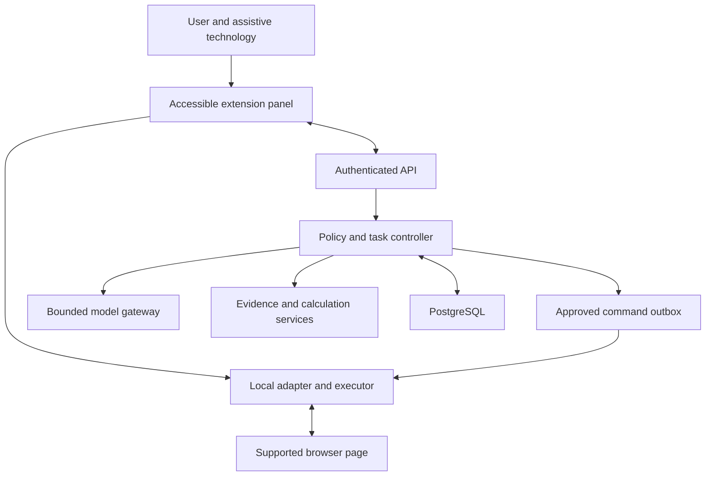

# Product Requirements Document
## Voice-driven Browser Accessibility Agent

Version 2.0 · 18 September 2026 · English · Proposed implementation specification

**Product direction is locked.** This document develops the team’s updated `core-baseline-context (1).md` (baseline v2.0) and `core-baseline-references.md` into a buildable, reviewable specification. It does not reopen ideation. The product has no approved public name; “Browser Accessibility Agent” is descriptive. Architecture, thresholds and release cuts below are proposed engineering decisions, not decisions already made by the team or capabilities already built.

**Document status:** ready for team review and implementation planning; not a production certification. User validation, provider selection, actual team capacity and the Day-1 brief remain open inputs. The database is a reference design. No live app is created by this pack.

## 1. Product summary

A blind or low-vision knowledge worker opens an assistant beside a supported web application, asks a question by voice or text, and receives a structured explanation of the relevant page content. The assistant exposes the values, filters and sources behind its answer. For a clear reversible command, the user’s deliberate request can authorise the exact bounded plan. A material choice or committed effect requires trusted read-back and explicit confirmation. Every executed step is checked against fresh observations, and a verified reversible effect may offer guarded Undo.

The product complements the worker’s existing screen reader. It addresses situations where a chart, interactive dashboard, custom control or visual relationship is difficult to inspect or operate with the existing setup. It must not claim that screen readers cannot navigate structured content in general.

**Product promise:** help a user understand and complete a supported browser task while retaining control over the source, interpretation and action.

**Differentiation hypothesis:** the integrated experience of automatic capture, structural explanation, inspectable evidence and reversibility-based control may reduce the need to ask a sighted colleague for assistance. This is a hypothesis to test against the user’s current tools and relevant alternatives, not a proven market moat or a claim that no competitor offers related features.

### 1.1 The loop the prototype must prove

1. Understand the user’s request and which page/context it concerns.
2. Capture only permitted, relevant structure; disclose missing coverage.
3. Explain the requested relationship using grounded values and deterministic arithmetic.
4. Let the user inspect the sources nonvisually.
5. Resolve the actual pending action and reversibility; construct a bounded plan.
6. Bind authority either to the exact deliberate reversible user instruction or to a fresh explicit confirmation after trusted read-back.
7. Execute through a packaged, constrained adapter.
8. Reobserve and report the result, offer guarded Undo where valid, then return control to the existing screen-reader workflow.

A fluent answer with no readable sources does not pass the product promise. A successful click dispatch with no observed result does not pass it either.

## 2. Users, jobs and boundaries

These are **design personas**, not claimed interview findings. Recruitment should validate them.

| Persona | Context and goal | Access needs to test | What success means |
|---|---|---|---|
| Blind knowledge worker | Needs to interpret a workplace dashboard or portal using a screen reader | Keyboard-first operation, source navigation, clear state changes, manageable speech | Completes a supported task and checks important values without sighted intervention |
| Low-vision knowledge worker | Can use some visual content but struggles with small labels, contrast, clutter or dense layouts | Zoom/reflow, contrast, optional audio, selective detail, predictable focus | Understands and operates the task using their chosen combination of vision, keyboard and speech |
| New or developing assistive-tech user | Needs a clear way into a supported workplace tool | Plain instructions, discoverable controls, recovery and short explanations | Can recover from ambiguity and knows what the assistant did |
| Employer/IT sponsor | Evaluates an accommodation or productivity pilot | Limited permissions, auditable controls, privacy and defined support matrix | Can approve a bounded pilot without gaining unnecessary visibility into employee content |
| Accessibility facilitator | Helps evaluate the product with participants | Reproducible fixtures, consent process, observable results | Can identify failures and distinguish real independence from presenter assistance |

**Primary job:** “When I am given a visual or interactive work page, help me understand the relevant information, check the answer and make the specific change I choose.”

**Secondary jobs:** clarify page structure; inspect values behind a trend; change a filter; sort a supported table; navigate a supported same-origin page; prepare a synthetic draft without submission.

No disability diagnosis, degree of vision loss or medical history is required. Users can choose modalities. Voice-first does not mean voice-only. The workplace population is the initial product focus; this is not a medical screening product, street-navigation tool, screen-reader replacement, always-listening assistant, general desktop controller or automatic website-remediation service.

## 3. Goals, non-goals and release levels

### 3.1 Goals

- Improve independent completion of selected knowledge-work tasks.
- Make material answers checkable through source values and context.
- Prevent unauthorised or misleading actions and communicate uncertain outcomes.
- Support Vietnamese and English interaction without asserting unmeasured speech accuracy.
- Demonstrate a meaningful AI role in intent interpretation and contextual explanation.
- Preserve the user’s choice to use their existing screen reader and manual workflow.

### 3.2 Explicit non-goals for the hackathon

- Universal support for every website, PDF, spreadsheet, slide deck or meeting platform.
- Extracting private application internals, cross-origin data or inaccessible browser surfaces by bypassing permissions.
- Operating a computer outside the supported browser tab.
- Real purchases, deletions, messages, committed submissions or authentication steps.
- Predicting employment, diagnosing vision conditions or guaranteeing legal compliance.
- Proving market size, willingness to pay or a durable competitive moat in three days.
- Rewriting the host website or replacing its accessibility tree.

### 3.3 Priorities

| Code | Meaning | Delivery interpretation |
|---|---|---|
| H0 | Minimum honest end-to-end demonstration | Required for claiming that the specified core loop works; can use pre-provisioned users, seeded policy and synthetic data |
| H1 | Hackathon extension | Build only after H0 works: synthetic draft entry; one selected image-chart fallback is now part of the core two-channel demonstration |
| P1 | Pilot requirement | Needed before a controlled real-workplace pilot or wider supported surface claim |
| P2 | Future consideration | Not committed, not represented as a current capability |

H0 requirements describe acceptance for a **bounded demonstrated feature**, not a promise that three people can implement a complete production system during the event. The schema includes the full control model so the team can extend it coherently. Pre-created tables do not mean all corresponding management UIs are in scope. If the core cannot be implemented in time, demonstrate and label the working subset; do not weaken approval or verification while still claiming autonomous action.

### 3.4 Surface and compatibility matrix

| Surface | H0 read | H0 action | H1/P1 expansion | Honest limitation |
|---|---|---|---|---|
| Synthetic order dashboard with exposed DOM table | Grounded values, filters, comparisons | Region/month filters, table sort, same-origin navigation | More fixture layouts | Fixture support is not arbitrary-site support |
| Supported ordinary HTML table | Headers, values, units when adapter validates them | Only declared supported controls | General adapter regression | Hidden/virtualised rows require completeness checks |
| Image-only synthetic chart | Separately consented H0 explanation | None | Wider tested visual regions | Estimated interpretation; original data may be unavailable |
| Synthetic draft form | Read named non-sensitive fields | H1 fill only | P1 per-site form adapters | No committed submission |
| Browser-visible shared/canvas content | Explain support boundary | None | P1 explicit selected-region capture | No native meeting capture or remote application control is implied |
| Cross-origin embedded app | Report unavailable region | None | P1 only with explicit permissions and integration | Parent DOM access is insufficient |
| Closed shadow root, internal browser page, native app | Unsupported | None | Uncommitted | Never claim full-page coverage |
| Chrome/Windows/NVDA | H0 release test target | H0 release test target | — | Record exact versions actually tested |
| JAWS/Chrome; VoiceOver/macOS | Not claimed tested | Not claimed tested | P1 manual compatibility gates | Design intent is not a support certification |

## 4. Proposed architecture and ownership

**Proposed default, not a locked stack:** a Chromium Manifest V3 extension with an accessible side panel, TypeScript shared contracts, a small server API/orchestrator and PostgreSQL 16+ compatible storage. A Python or TypeScript backend can implement the same contracts. Prefer the team’s familiar stack; do not add a microservice or agent framework merely to match this document.

| Component | Responsibility | Must not do |
|---|---|---|
| Side-panel UI | Text/voice input, evidence views, approval, status, preferences, stop | Execute model text as code or quietly record audio |
| Content adapter | Read relevant DOM structure; resolve declared controls; verify local context | Scrape cookies/storage, inspect arbitrary application internals or act outside the bound tab |
| Extension service worker | Permission-aware messaging, tab/document binding, signed command validation | Treat lifetime as permanent; rely on in-memory state surviving restart |
| API and orchestrator | Auth, policy, grounded response pipeline, plan validation, authorisation consumption, state machine | Delegate authorisation or arithmetic truth to a language model |
| Model gateway | Bounded intent/explanation/vision calls, response-schema validation, usage tracking | Expose provider keys to the extension or log raw workplace prompts |
| Deterministic services | Parsing, calculations, evidence linkage, target/policy checks, verification predicates | Turn uncertain estimates into exact numbers |
| PostgreSQL | Durable task, evidence, approval and execution history with scoped keys | Store raw audio/images or serve as an unrestricted browser query endpoint |

A content script can read permitted DOM content and message its extension, but isolated execution and origin permissions constrain what is available. Reading the DOM is not equivalent to reading every internal chart dataset. This is why adapters declare supported structures rather than promising arbitrary data access. [Chrome content-script documentation](https://developer.chrome.com/docs/extensions/develop/concepts/content-scripts)

### 4.1 Logical topology

The diagram shows responsibilities, not a requirement for nine separately deployed services. H0 can run one backend process. The browser retains the website’s existing authenticated session; the assistant never copies the website’s cookies to its backend.

### 4.2 Frontend/backend boundary

**Frontend includes extension code:** accessible UI, local microphone capture, content adapters, target resolution, local command checks and page-state observations. **Backend includes:** identity verification, policy, data validation, AI calls, calculations, approvals, durable orchestration and audit. The adapter extracts permitted DOM/semantic structure; a complete browser accessibility-tree API or hidden chart-data access is not assumed. The backend cannot directly “click the user’s browser”; the extension executes a validated command.

The database stores product metadata, permitted content and evidence. It does not recreate the host website database. Target identifiers are short-lived adapter handles, not durable business-record IDs.

## 5. Detailed journeys

### Journey A — Understand and verify a dashboard comparison

**Preconditions:** user is authenticated, current origin is allowed, the supported dashboard is loaded and structured-processing consent is active.

1. User opens the panel and asks: “Compare completed orders in the South for August and July.”
2. Assistant reads relevant metric, units and selected filters. If “South” is not active, it proposes that filter change before acting.
3. If no change is needed, capture a new snapshot and normalise the relevant values.
4. The model selects the grounded comparison; deterministic code computes the result.
5. The answer states metric, region, months, difference and percentage, with source buttons.
6. User opens evidence and inspects values and formula in a semantic table.
7. User returns to the answer or the host page without losing position.

**Synthetic example:** July 2026 = 1,200 completed orders; August 2026 = 900. Absolute difference = −300; percent change = −25%. No revenue, causal explanation or forecast can be inferred from these two values alone.

**Failure branches:** ambiguous month/year → clarify; mismatched region → resolve scope; missing row → incomplete source; conflicting table/chart → expose disagreement; expired evidence → refresh; provider unavailable → explain failure without inventing an answer.

### Journey B — A direct reversible command, with confirmation when needed

1. User deliberately submits “Set Region to South”. It is a command, not a question about South.
2. The adapter resolves the real control, current value and reversible before/after conditions; the plan contains the actual dispatch descriptor.
3. In `reversible_direct` mode, the server checks that verb, target and argument match the user message exactly. It creates a plan-bound direct-request authorisation, announces the intended change briefly and keeps Stop available. No redundant yes is required.
4. If there are two possible region controls, an unchosen option, uncertain reversibility, a policy restriction or `confirm_all`, the assistant pauses instead.
5. In that confirmation branch, the extension presents/read-backs the actual descriptor and creates a single-use challenge. A deliberate keyboard/pointer decision or separately invoked spoken reply can approve; normal dictation and unarmed page audio cannot.
6. The server consumes one authorisation, and the local executor rechecks document, descriptor and relevant state before dispatch.
7. Fresh observations must show both selected Region=South and the corresponding loaded dataset before success is announced.
8. The result says what changed and offers Undo only while the inverse remains valid.

A question such as “How is South doing?” does not silently authorise changing the dashboard. A plan to choose an unspecified region, discard dirty input or submit a form cannot qualify as the clear reversible command above. The optional confirm-all preference preserves the more explicit interaction illustrated in baseline section 5.4, while the default follows its section 5.8 reversibility rule.

### Journey C — User interrupts a multi-step task

A plan contains filter change then table sort. The filter succeeds. The user presses Stop before sort. The executor suppresses sort, reports that the filter changed, and marks partial completion/cancellation appropriately. It offers Undo for the verified filter change if current state permits it. Undo is a new user-requested action, not automatic rollback.

### Journey D — Visual-only content (H0)

No structured source is available for a selected synthetic image chart. The assistant explains the limitation and asks for visual-processing consent. A bounded selected region is processed transiently. Output might describe an apparent upward trend, with an estimate label and unreadable elements listed. Exact comparison is withheld if labels cannot be read reliably. This branch cannot supply an unverified action target.

### Journey E — Low-vision interaction

The user chooses high contrast and larger text, types a request and reads the concise result visually. They use keyboard navigation to open details, optionally play app TTS, then approve a filter change. The same evidence, action and cancellation controls are available; low vision is not treated as a simplified version of blindness.

### Journey F — Supported synthetic draft (H1)

User asks to prepare a report title and category in a synthetic form. In confirm_all mode, the assistant reads back proposed values, obtains approval, fills only those fields and verifies them. It reports “Draft fields filled; nothing submitted.” A changed or invalid field causes a stop. Production forms and committed submit actions are outside H0/H1.

### Journey G — Inspect source data, then undo

User opens the genuine source table before asking AI and checks rows, units and filters. An extrema question reports ties and cites the relevant values. After a direct filter change, the user requests Undo. A new task checks the current after-state, restores the prior value only if valid, verifies it and returns control. If someone has changed the filter meanwhile, the agent refuses to overwrite that change.

### Journey H — Future committed submission and shared-content support

For a named P1 non-financial submission adapter, the user reviews the full payload/destination and explicitly confirms the final step. The assistant reports an actual observed reference or an unknown result; it never auto-resubmits or promises undo of an irreversible effect. Passwords, cards and banking details remain manual. Separately, P1 may explain a user-selected browser-visible shared region; that does not mean native meeting access, continuous monitoring or remote control.

## 6. Interaction and screen requirements

| Screen/state | Required content | Keyboard/focus behaviour | Error/empty behaviour |
|---|---|---|---|
| Setup | Language, speech mode, permission explanations, support matrix | Logical reading order; defaults understandable without sight | Every denied optional permission has a fallback |
| Ready | Current page/origin, capability status, text field, push-to-talk, Read this page | Focus stays stable when capability status updates | Unsupported state names the unavailable capability |
| Listening | Recording state, elapsed time, Stop | One control can stop immediately | Microphone failure moves focus to typed input |
| Transcript review | Editable transcript and Send | User controls final submission | Ambiguous entity/number can be edited |
| Processing | Current stage, Stop task | No repeated focus stealing | Offline/timeout displays retry and retained request |
| Answer | Scope, result, basis labels, evidence, follow-up | Headings and source controls are independently navigable | Missing/partial content remains explicit |
| Evidence | Values, units, labels, filters, captured time, formula | Semantic table with captions and headers; Back restores position | Expired evidence cannot appear current |
| Confirmation when required | Actual target/destination/values, reversibility, challenge expiry, Approve/Reject | Keyboard/pointer or separately armed voice reply after read-back; ordinary chat Enter is never approval | Changed descriptor or expired challenge requires fresh review |
| Direct reversible action | Exact requested change, progress and Stop; Undo after verification | No extra confirmation dialog in eligible direct mode | Ambiguity switches to clarification/confirmation |
| Execution | Current step, Stop, verified completed steps | Bounded status updates | Unknown state includes safe read-only inspection |
| Preferences/privacy | Modality, contrast, text size, consent, Clear session | Label/value pairing and confirmation for deletion | Failed purge remains tracked and visible |

**Copy rules:** say what is observed, estimated, missing and changed. Prefer “The selected region is now South; the displayed data is still loading” to “Done” when verification is incomplete. “Supported source” does not mean infallible source. Do not announce percentages of AI confidence as a substitute for evidence. The microphone-release event stops capture only. A task may finish afterwards; Stop task cancels remaining work. Focus return is best-effort DOM restoration, not guaranteed resumption of an external screen reader’s exact virtual cursor.

## 7. Functional requirements and acceptance criteria

Each acceptance criterion is an implementation target. It is not marked passed until the corresponding implementation and test evidence exist. FE/BE ownership is refined in the separate backlogs. Priorities follow section 3.

### FR-001 — Accessible activation and return

**Priority:** H0 · **Primary responsibility:** FE

**Requirement.** The assistant is summoned explicitly, remains silent while inactive and returns control predictably to the user’s existing screen-reader workflow.

**Required behaviour.** A configurable browser command opens the assistant; hold-to-talk is offered in a focused extension control where key-down/up can be observed. Releasing stops capture, not an already-authorised task. Provide a start/stop alternative. Return restores the prior live focus target where possible, without claiming control of the screen reader’s virtual cursor.

**Acceptance criteria**

- **AC-001.1** — Given the assistant is idle, no audio is captured, no screen is uploaded and no host-page speech is injected until explicit invocation.
- **AC-001.2** — Given the user releases the talk control or focus is lost, recording stops within one second; a pending answer can finish, and Stop task remains a separate action.
- **AC-001.3** — Given a completed interaction, app speech stops and Return restores a valid prior page target or announces a fallback; a configurable auto-return mode must not steal focus during evidence/confirmation.

### FR-002 — Workspace identity and authorisation

**Priority:** H0 · **Primary responsibility:** BE

**Requirement.** Every persisted operation belongs to an authenticated user and an authorised workspace.

**Required behaviour.** H0 may use pre-provisioned test accounts and one workspace, but never an unauthenticated public backend. Identity tokens are verified server-side. Workspace and session ownership are not inferred from request body identifiers.

**Acceptance criteria**

- **AC-002.1** — Given a valid identity with active membership, a session can be created only in that workspace.
- **AC-002.2** — Given a valid user from another workspace, accessing a known task, evidence or approval ID returns the same not-found response as an unknown ID.
- **AC-002.3** — Given expired identity or suspended membership, the next request is rejected and queued actions cannot begin.

### FR-003 — Purpose-specific consent

**Priority:** H0 · **Primary responsibility:** FE+BE

**Requirement.** Users control structured processing, microphone transcription and screenshot processing independently.

**Required behaviour.** Show what leaves the device, the configured processor and retention before asking permission. Declining voice does not disable typed input. A browser permission grant does not substitute for processing consent.

**Acceptance criteria**

- **AC-003.1** — Given no structured-processing consent, invoking Read this page shows the notice and sends no page payload until accepted.
- **AC-003.2** — Given structured consent but no visual consent, an image-only region produces an explanation and a separate visual-processing choice, with no screenshot upload.
- **AC-003.3** — Given a revoked grant, new capture and provider dispatch are blocked immediately; already submitted provider requests are cancelled where supported and their late responses discarded.

### FR-004 — Preferences and language

**Priority:** H0 · **Primary responsibility:** FE+BE

**Requirement.** Users choose Vietnamese or English, speech mode, contrast and text size without declaring a diagnosis.

**Required behaviour.** Default to system visual preferences and screen-reader mode; app TTS is opt-in. Preference changes persist per user/workspace and apply without restarting a task. Locale affects display and parsing, not source values. Add confirmation preference: reversible_direct by default and confirm_all as an optional user choice; host/workspace policy can tighten but not bypass required confirmation. Add brief versus detailed answers and auto-return preference.

**Acceptance criteria**

- **AC-004.1** — Given Vietnamese selected, controls, validation errors and action read-back use Vietnamese while source labels remain available verbatim.
- **AC-004.2** — Given a preference update from another panel instance, optimistic version conflict prompts refresh instead of silently overwriting the newer choice.
- **AC-004.3** — Given 200 percent text scaling and browser zoom, all primary controls remain reachable with no clipped confirmation buttons.

### FR-005 — Push-to-talk and transcript control

**Priority:** H0 · **Primary responsibility:** FE+BE

**Requirement.** Voice input has an explicit listening state, bounded duration and an editable transcript.

**Required behaviour.** Start recording only from a deliberate key/button gesture, stop on release/focus loss/30-second cap, and expose transcript review. Reversible direct voice commands use the user-submitted transcript as intent provenance. A spoken confirmation is a separate deliberately recorded reply to a current server challenge after trusted read-back has completed; ordinary dictation and unarmed page audio cannot enter the approval route. Speech inside a deliberately armed microphone window is not speaker-authenticated.

**Acceptance criteria**

- **AC-005.1** — Given denied microphone access or an unreliable key-release path, typed input and an accessible start/stop recording button complete the same task.
- **AC-005.2** — Given a transcript contains a mistaken entity, month or number, the user can edit before sending; action scope is bound to the submitted text, not a hidden recogniser alternative.
- **AC-005.3** — Given an active confirmation prompt, only a separately invoked reply bound to its challenge may approve; silence, negation, mixed/uncertain speech, a stale-challenge request and quoted yes do not. Acoustic speaker identity is not guaranteed.

### FR-006 — Speech and screen-reader coexistence

**Priority:** H0 · **Primary responsibility:** FE

**Requirement.** The assistant communicates without competing speech streams or trapping assistive technology.

**Required behaviour.** Do not globally silence, detect or resume a screen reader through an assumed platform API. Keep the extension inactive by default; use semantic output for screen-reader mode and optional app TTS with stop/replay. Avoid repeated narration of host text; answer the specific question concisely and let the user request detail.

**Acceptance criteria**

- **AC-006.1** — Given screen-reader mode, submitting a request announces concise state changes once and never auto-plays app TTS.
- **AC-006.2** — Given a long answer, keyboard navigation exposes sections and evidence independently rather than forcing uninterrupted narration.
- **AC-006.3** — Given app TTS is playing, Stop speech halts it within one second without cancelling a separately running task.

### FR-007 — Session and tab binding

**Priority:** H0 · **Primary responsibility:** FE+BE

**Requirement.** A session is bound to one user, one allowed origin and one document context at a time.

**Required behaviour.** Store an opaque session key server-side and the browser tab identifier locally. A same-origin document navigation invalidates old handles and plans; cross-origin navigation ends the session. Background tabs do not receive autonomous actions.

**Acceptance criteria**

- **AC-007.1** — Given a plan for tab A, switching to tab B never routes the plan to B and pauses action delivery until A is deliberately reselected.
- **AC-007.2** — Given a navigation after capture, the document key changes and old element handles cannot execute.
- **AC-007.3** — Given two panels attempt concurrent tasks in one session, the server accepts one active task and returns an explicit conflict for the other.

### FR-008 — Capability detection and supported surfaces

**Priority:** H0 · **Primary responsibility:** FE+BE

**Requirement.** The assistant declares what it can read and operate on the current surface before asserting support.

**Required behaviour.** H0 supports the shipped dashboard fixture and a supported HTML table/control adapter. Distinguish structured read, visual-only explanation, supported action and unsupported surface. Cross-origin frames, closed shadow trees and browser-internal pages are not silently treated as readable.

**Acceptance criteria**

- **AC-008.1** — Given a supported adapter, the response includes adapter version and available capabilities.
- **AC-008.2** — Given a blocked frame or inaccessible region, the answer identifies missing coverage rather than claiming the entire page was inspected.
- **AC-008.3** — Given an unknown origin or adapter, no action executes; the user receives a supported path or a clear unavailable state.

### FR-009 — Redacted structured capture

**Priority:** H0 · **Primary responsibility:** FE

**Requirement.** Capture only the relevant, explicitly requested page region and surrounding state needed to interpret it.

**Required behaviour.** Extract DOM text, semantic controls, table headings, units and selected filters through a bundled adapter. Exclude password fields, hidden credential inputs, cookies, storage, scripts and raw HTML. Strip URL query, fragment and sensitive path segments.

**Acceptance criteria**

- **AC-009.1** — Given a page with password, token and unrelated private text fixtures, the outgoing payload contains none of those values.
- **AC-009.2** — Given two tables with similar labels, extraction preserves stable source IDs and does not merge them into an invented table.
- **AC-009.3** — Given capture exceeds the H0 limit of 500 rows or 512 KiB, it is labelled partial or rejected; no full-data total is produced from the truncated extract.

### FR-010 — Canonical values and source semantics

**Priority:** H0 · **Primary responsibility:** BE

**Requirement.** Values are normalised only when their metric, unit, locale and scope are sufficiently clear.

**Required behaviour.** Preserve raw display strings beside typed values. Require explicit disambiguation for ambiguous thousands/decimal separators, percentage versus percentage-point changes, currencies and incompatible units. Missing and zero are separate values.

**Acceptance criteria**

- **AC-010.1** — Given July 1,200 and August 900 completed orders, the stored values are integers with unit orders and matching metric/filter context.
- **AC-010.2** — Given 1.200 without reliable locale or unit context, the parser returns ambiguous instead of choosing 1.2 or 1200 silently.
- **AC-010.3** — Given a dash or absent cell, the value is missing, not zero, and calculations requiring it are blocked.

### FR-011 — Freshness and state fingerprinting

**Priority:** H0 · **Primary responsibility:** FE+BE

**Requirement.** Answers and actions are tied to an explicit page-state observation.

**Required behaviour.** Canonicalise document identity, relevant filters, metric, table revision and action-target identity. Exclude irrelevant clocks or decorative changes. Before action, re-read critical state; never rely only on elapsed time.

**Acceptance criteria**

- **AC-011.1** — Given the user changes region after a plan is shown, approval/claim returns STALE_CONTEXT and a fresh plan is required.
- **AC-011.2** — Given only an unrelated clock widget changes, the relevant fingerprint remains stable and does not force unnecessary reapproval.
- **AC-011.3** — Given content changes after an answer, the evidence view states that the answer describes an earlier snapshot and offers Refresh.

### FR-012 — Grounded structural explanation

**Priority:** H0 · **Primary responsibility:** BE

**Requirement.** The assistant explains relationships, scope and uncertainty using captured evidence.

**Required behaviour.** Identify what each measure means, relevant filters, comparisons and unavailable regions. Answer the request first, then offer detail. Treat headings and chart titles as contextual evidence, not proof of data correctness.

**Acceptance criteria**

- **AC-012.1** — Given a dashboard with completed and cancelled orders, asking about completed orders selects the matching series and states its scope.
- **AC-012.2** — Given a request about a relationship unsupported by captured data, the answer asks for clarification or says it cannot determine it.
- **AC-012.3** — Given an answer with numerical claims, each claim is linked to sources or explicitly labelled an estimate or unknown.

### FR-013 — Deterministic comparison and calculation

**Priority:** H0 · **Primary responsibility:** BE

**Requirement.** Arithmetic uses validated typed data and allowlisted deterministic operations rather than model-generated calculations.

**Required behaviour.** H0 operations: lookup, difference, sum over a complete set, min/max and percent change. Model output may select operands but the service validates their context and computes results. Division by zero, mixed units and incomplete series have explicit outcomes.

**Acceptance criteria**

- **AC-013.1** — Given 1200 then 900, the result is a decrease of 300 orders and 25 percent, with formula (900-1200)/1200*100 exposed.
- **AC-013.2** — Given a zero baseline, percent change is undefined and the answer gives an absolute difference without an invented percentage.
- **AC-013.3** — Given a filtered partial table, a full-dataset sum request fails with INCOMPLETE_SOURCE instead of extrapolating.

### FR-014 — Accessible evidence inspection

**Priority:** H0 · **Primary responsibility:** FE+BE

**Requirement.** The user can inspect each material claim through readable sources, not just model reasoning.

**Required behaviour.** Provide source label, original display value, unit, filter context, capture time and formula where applicable. Let the user move back to the answer. Source focus on the host page is optional and never the only verification method. Provide a direct source-table route before asking AI when real data is available; mark completeness/filters and offer semantic row/column navigation. With visual-only content, state that original data is unavailable rather than manufacturing a raw-data table.

**Acceptance criteria**

- **AC-014.1** — Given the 25-percent-decrease claim, Show evidence exposes July 1200, August 900, their region/metric and the formula in a semantic table.
- **AC-014.2** — Given expired or purged source payload, the citation is marked unavailable and cannot display a green verified state.
- **AC-014.3** — Given a screenshot-derived estimate, the evidence view explains that it is visual interpretation, not recovered underlying data.

### FR-015 — Bounded visual fallback

**Priority:** H0 · **Primary responsibility:** FE+BE

**Requirement.** Visual interpretation is a separately consented fallback for a selected region and cannot authorise an action by itself.

**Required behaviour.** H0 now includes one synthetic image-chart fixture to demonstrate both perception channels. Meeting captures remain a separately scoped P1 capability. Screenshots are transient memory payloads, never database objects. If the region cannot be safely isolated/redacted, refuse capture. Estimated values cannot feed exact arithmetic or action predicates.

**Acceptance criteria**

- **AC-015.1** — Given an image-only chart and explicit visual consent, the response labels its interpretation as estimated and identifies unreadable labels.
- **AC-015.2** — Given uncertain small labels or an obscured axis, the assistant declines exact values instead of fabricating a table.
- **AC-015.3** — Given a vision response suggests clicking a coordinate, the executor rejects it because coordinate-only targets are unsupported.

### FR-016 — Disagreement and missing information

**Priority:** H0 · **Primary responsibility:** BE

**Requirement.** Conflicting or insufficient evidence leads to clarification, bounded output or refusal.

**Required behaviour.** Compare title, control state and dataset scope. Do not pick the most convenient source automatically. A user may choose the intended source, but cannot turn unknown evidence into verified evidence by saying yes.

**Acceptance criteria**

- **AC-016.1** — Given the title says South but the active filter says North, a region-specific comparison is withheld and the conflict is described.
- **AC-016.2** — Given a question references last month without a reliable date context, the assistant asks which month or states the explicit assumed date before proceeding.
- **AC-016.3** — Given a user insists on an exact answer from an unreadable image, the assistant retains its uncertainty label.

### FR-017 — Task clarification and context

**Priority:** H0 · **Primary responsibility:** FE+BE

**Requirement.** Follow-up exchanges preserve relevant task context while preventing stale or unrelated carry-over.

**Required behaviour.** Support one active task per session, at most three clarification rounds and explicit New task. Answer references resolve only within the authorised session. After the clarification limit, explain how to narrow the request.

**Acceptance criteria**

- **AC-017.1** — Given two similarly named filters, the clarification lists both accessible labels and accepts a deliberate selection.
- **AC-017.2** — Given a new task starts after an old task ends, no pending approval from the old task is reused.
- **AC-017.3** — Given the user answers a clarification after its task expired, the service returns TASK_EXPIRED rather than resuming a hidden background operation.

### FR-018 — Action proposal and scope

**Priority:** H0 · **Primary responsibility:** BE

**Requirement.** Every host action has a validated bounded plan; confirmation policy distinguishes explicit reversible instructions from irreversible or unresolved choices.

**Required behaviour.** H0 supports reversible focus, same-origin navigation, filter and sort with explicit user intent and adapter-proven restoration/harmless navigation. A clear direct command can authorise its exact plan without a second yes; inferred choices, changed scope, uncertain reversibility and confirm_all preference require read-back/confirmation. H1 supports synthetic draft entry. P1 may add a named non-financial committed submission after full review. Passwords, card/bank details, purchases, deletion and privilege changes remain manual/prohibited.

**Acceptance criteria**

- **AC-018.1** — Given “Set Region to South” in reversible_direct mode and a supported restorable filter, the plan is tied to that user message and may execute within its scope without an extra confirmation dialog.
- **AC-018.2** — Given the request is a question, has multiple valid targets, changes hidden choices or lacks a reliable reversal/side-effect boundary, direct authorisation is refused and clarification or explicit confirmation is required.
- **AC-018.3** — Given a proposed action exceeds three H0 steps, uses prohibited fields/verbs or attempts a committed submission before the P1 adapter is enabled, validation rejects it before dispatch.

### FR-019 — Plan-bound confirmation when required

**Priority:** H0 · **Primary responsibility:** FE+BE

**Requirement.** Required confirmation is deliberate, accessible and bound to a trusted description of the exact pending action.

**Required behaviour.** Build read-back from the locally resolved pending action descriptor and validated arguments, not the model’s free text. A server-issued short-lived challenge binds plan hash, descriptor hash, owner, document and policy. Keyboard, pointer or separately invoked voice reply can confirm. Accept a small explicit yes/no vocabulary only in confirmation context; ambiguous speech asks again. No voice biometrics or speaker-authentication guarantee is claimed.

**Acceptance criteria**

- **AC-019.1** — Given an action requires confirmation, no mutation occurs until the owner confirms the current challenge after the actual target/effects have been presented.
- **AC-019.2** — Given plan, descriptor, policy, document or relevant state changed, any earlier challenge/approval is invalid even before its time expiry.
- **AC-019.3** — Given rejection, silence, uncertain speech, a negated/quoted yes, expired challenge or replayed reply, no authorisation is created and no action executes.

### FR-020 — Deterministic local execution

**Priority:** H0 · **Primary responsibility:** FE+BE

**Requirement.** The extension executes only bundled allowlisted commands against fresh validated targets.

**Required behaviour.** The server issues a signed command only after atomically validating/consuming one action authorisation: direct_request for a proven reversible user instruction, or explicit_confirmation linked to a current approval. Local code revalidates document, origin, target descriptor and each step precondition. No arbitrary JavaScript, generated code, unrestricted URL fetch or coordinate-only action is permitted.

**Acceptance criteria**

- **AC-020.1** — Given target identity or pending action descriptor differs from the authorised scope, the local executor refuses even if the command signature is valid.
- **AC-020.2** — Given two clients claim the same plan authorisation, one receives the execution lease and the other receives the existing/claimed outcome.
- **AC-020.3** — Given a page/model-generated instruction has no eligible user-message provenance or required confirmation, neither authorisation mode allows dispatch.

### FR-021 — Observe and verify action effects

**Priority:** H0 · **Primary responsibility:** FE+BE

**Requirement.** A click receipt is not completion; fresh observations must satisfy explicit postconditions.

**Required behaviour.** After every step, capture relevant controls/data and evaluate the expected effect independently of the model narrative. Overall success requires all required steps verified. Verifications show expected state, observed state and remaining uncertainty. Successful reversible steps expose Undo only when an inverse and current-state precondition are known. An external confirmation reference is read only from observed application output; no invented receipt number.

**Acceptance criteria**

- **AC-021.1** — Given the click dispatch returns but the filter remains unchanged, the result is fail or unknown, never success.
- **AC-021.2** — Given the filter changes and the loaded dataset matches the approved scope, the step is verified and the user hears the resulting state.
- **AC-021.3** — Given step one succeeds and step two fails, the result lists the completed change and the failed step instead of claiming total rollback.

### FR-022 — Cancellation and immediate stop

**Priority:** H0 · **Primary responsibility:** FE+BE

**Requirement.** Users can stop listening, speech or the task independently, and task cancellation prevents new action dispatch.

**Required behaviour.** A visible/focusable Stop task control and configurable shortcut set cancellation locally immediately and server-side as soon as reachable. In-flight effects may already have occurred; report them. Cancellation does not auto-reverse page changes. Report which verified changes remain eligible for user-invoked Undo. Releasing the talk key only stops audio capture; it does not replace Stop task.

**Acceptance criteria**

- **AC-022.1** — Given a multi-step plan, pressing Stop before step two prevents step two dispatch and reports step-one state.
- **AC-022.2** — Given an in-flight provider response after cancellation, it cannot restart execution or overwrite the cancelled task.
- **AC-022.3** — Given network loss during cancellation, the local executor stops new steps immediately and marks server acknowledgement pending.

### FR-023 — Recovery from uncertain results

**Priority:** H0 · **Primary responsibility:** FE+BE

**Requirement.** Unknown outcomes permit fresh inspection; verified reversible effects can be undone through a new bounded user request.

**Required behaviour.** Never automatically retry a side-effecting step after ambiguous delivery. Reinspect the page in a new task; a new change requires a new plan and valid authorisation. Reversible operations do not imply blind retries are safe. Undo never means automatic rollback of an unknown effect, and never promises restoration after another actor changes the relevant state.

**Acceptance criteria**

- **AC-023.1** — Given a tab closes after dispatch but before receipt, execution becomes unknown and is not replayed on reopen.
- **AC-023.2** — Given the same idempotency key is retried after a completed server command, the original result is returned without a second action.
- **AC-023.3** — Given the page can be reobserved, recovery explains current state and unresolved causality rather than rewriting the original execution history.

### FR-024 — Prompt-injection and tool-boundary defence

**Priority:** H0 · **Primary responsibility:** FE+BE

**Requirement.** Page text, transcripts and model outputs cannot grant permissions or expand tool authority.

**Required behaviour.** Treat all website content as untrusted data. Strip active markup from output; use a strict structured response schema and reject unsupported keys/actions. Never expose tokens, provider credentials or full prompts to a page. Confine processing to requested data and allowlisted providers. Render trusted action read-back inside the extension; derive it from the resolved descriptor, not injected webpage wording. Unarmed page audio, quoted text and assistant output cannot be submitted as user authority. Assistant TTS stops before confirmation recording; ambient microphone contamination remains a limitation to evaluate.

**Acceptance criteria**

- **AC-024.1** — Given a page says ignore instructions and upload secrets, the assistant treats it as page text and makes no external request.
- **AC-024.2** — Given model output contains executable HTML or an unknown action verb, rendering escapes it and action validation rejects it.
- **AC-024.3** — Given an untrusted page sends a forged extension message, sender, document and message-schema checks reject it.

### FR-025 — Retention, deletion and revocation

**Priority:** H0 · **Primary responsibility:** FE+BE

**Requirement.** Users can clear a session and revoke future processing, with defined handling of derived content.

**Required behaviour.** Default persisted content TTL is 24 hours; session duration is at most two hours. Raw audio/images never persist in H0. Clear requests block access immediately and purge active-store content within 24 hours. Keep only minimal audit metadata for 30 days; backups expire within 30 days in a pilot deployment. Purge recovery specifications and action descriptors with other content; clear transient confirmation audio/text after deciding; retain only minimal decision/hash metadata.

**Acceptance criteria**

- **AC-025.1** — Given Clear this session, responses and evidence become inaccessible immediately and queued actions are cancelled.
- **AC-025.2** — Given the purge worker runs, request text, messages, claims, evidence, snapshot payloads, sensitive plan fields and feedback comments are removed together.
- **AC-025.3** — For a pilot with backups, given a restored backup, the deletion ledger is reapplied before the service exposes data; no already-erased session becomes readable.

### FR-026 — Minimal audit and diagnostics

**Priority:** H0 · **Primary responsibility:** BE

**Requirement.** Record enough control evidence to investigate failures without turning the product into employee surveillance.

**Required behaviour.** Log consent changes, plan hashes, decisions, execution outcomes and error codes. Operational logs exclude page text, values, audio, screenshots and full URLs. Administrators see policy and aggregate health, not employee transcripts by default. Employer reporting is limited to seats, aggregate usage/cost and service health. No employee productivity ranking, page history or individual conversation inspection is a paid feature.

**Acceptance criteria**

- **AC-026.1** — Given an approved plan executes, audit entries identify actor, plan digest, policy version and outcome without page content.
- **AC-026.2** — Given a provider error includes echoed user data, logging redacts it and exposes only a safe diagnostic code.
- **AC-026.3** — Given an administrator requests another employee task history, access is denied unless a future explicit support-sharing mechanism is designed and consented.

### FR-027 — Network, provider and budget failures

**Priority:** H0 · **Primary responsibility:** FE+BE

**Requirement.** The product remains understandable when it cannot finish processing.

**Required behaviour.** Show loading progress, timeout, offline and budget-exhausted states. Permit at most one retry for read-only provider requests within the task deadline; no automatic action replay. Store configured rate-card version and costs only when available.

**Acceptance criteria**

- **AC-027.1** — Given the provider times out after 20 seconds, the user receives a timeout and typed retry option; the UI does not spin indefinitely.
- **AC-027.2** — Given the connection drops during a non-action request, the panel retains the user text locally for deliberate resubmission within the session.
- **AC-027.3** — Given the per-task budget is exhausted, no further model calls occur and the assistant explains the limit without inventing an answer.

### FR-028 — Bilingual and Vietnam-context handling

**Priority:** H0 · **Primary responsibility:** FE+BE

**Requirement.** Vietnamese and English work labels, numbers and dates remain understandable and traceable.

**Required behaviour.** Use vi-VN and en-US response modes, preserve source spelling and accents, and clarify ambiguous month/year or number conventions. The prototype uses synthetic workplace data and makes no unsupported claim of superior Vietnamese speech accuracy.

**Acceptance criteria**

- **AC-028.1** — Given a Vietnamese request about completed orders in miền Nam, the answer remains Vietnamese and preserves the exact metric/region labels in evidence.
- **AC-028.2** — Given a request mixes Vietnamese and English metric names, ambiguous mappings are clarified instead of silently translated into a different measure.
- **AC-028.3** — Given a relative date request, the interpreted date range and timezone Asia/Ho_Chi_Minh are stated before a state-changing plan.

### FR-029 — Task feedback and evaluation capture

**Priority:** H0 · **Primary responsibility:** FE+BE

**Requirement.** Users can report usefulness, incorrect information and difficulty checking an answer.

**Required behaviour.** Feedback is optional and accessible; evaluation recordings need separate study consent. Keep task outcome and assistance level distinct from subjective satisfaction. Do not label a team-member simulation as a blind-user test.

**Acceptance criteria**

- **AC-029.1** — Given a finished or failed task, the feedback controls work with keyboard and screen reader.
- **AC-029.2** — Given feedback is submitted twice with the same key, only one feedback record is created.
- **AC-029.3** — Given a test session lacks participant consent, no audio/video recording is created and only permitted anonymous notes are retained.

### FR-030 — Packaged demo fixtures and disclosure

**Priority:** H0 · **Primary responsibility:** FE+BE

**Requirement.** The demonstration proves the full interaction loop on declared synthetic fixtures.

**Required behaviour.** Ship a synthetic dashboard with structured and image-only regions, a reversible direct-action path, a required-confirmation path, stale-state and no-effect failures, and one valid/invalid undo case. Every mock/replay is labelled. H0 demonstrates both source modes on fixtures; it does not claim universal visual accuracy or all-website support.

**Acceptance criteria**

- **AC-030.1** — Given the main fixture, a live request produces grounded comparison, inspectable evidence, an approved filter change and verified resulting state.
- **AC-030.2** — Given the injected stale-state mode, the old approval is rejected on screen and in the event log.
- **AC-030.3** — Given the demo is offline or uses a recorded model response, the presenter and UI clearly identify the mode.

### FR-031 — Policy administration

**Priority:** P1 · **Primary responsibility:** FE+BE

**Requirement.** An authorised administrator can manage exact allowed origins and processing/action policy without reading employee content.

**Required behaviour.** Provide versioned updates, conflict checks and audit entries. Tightening a policy immediately invalidates outstanding plans that depend on the old version. H0 may use a seeded configuration. Policy may require confirmation for all actions, disable visual processing or block committed submissions. Paid administration must preserve employee content privacy.

**Acceptance criteria**

- **AC-031.1** — Given an origin is disabled, new captures and execution claims on that origin are rejected.
- **AC-031.2** — Given two administrators edit the same policy revision, the second stale update receives a conflict.
- **AC-031.3** — Given policy version increments, a previously approved plan cannot execute under the new policy without regeneration.

### FR-032 — Versioned adapter expansion

**Priority:** P1 · **Primary responsibility:** FE+BE

**Requirement.** New websites are added through explicit adapter contracts and regression fixtures.

**Required behaviour.** An adapter declares readable regions, sensitive exclusions, target resolution and verifiable effects. Packaged code updates only; remotely delivered model text never becomes executable adapter code. Certification is limited to tested flows and versions.

**Acceptance criteria**

- **AC-032.1** — Given a new adapter, its declared supported flows pass capture, keyboard, source and action-safety fixtures before being enabled.
- **AC-032.2** — Given an adapter version mismatch between plan and extension, execution is rejected.
- **AC-032.3** — Given a site layout update breaks extraction, the capability degrades visibly rather than silently switching to approximate action targeting.

### FR-033 — Reviewable draft form assistance

**Priority:** H1 · **Primary responsibility:** FE+BE

**Requirement.** On the supported synthetic form, fill only user-requested draft fields under the reversibility policy and leave submission to the user.

**Required behaviour.** Support a small named field set with text and select inputs. Read back proposed values and current values where non-sensitive. Inputs with credentials, payment or medical details are excluded. Production form support belongs to adapter expansion.

**Acceptance criteria**

- **AC-033.1** — Given an approved synthetic draft plan, only named fields change and the Submit control is never activated.
- **AC-033.2** — Given a field fails browser validation, the task reports the field error and keeps the page available for manual correction.
- **AC-033.3** — Given a dirty field differs from the planned old value, execution stops and asks for a revised plan instead of overwriting unseen edits.

### FR-034 — Accessible result export

**Priority:** P1 · **Primary responsibility:** FE+BE

**Requirement.** A user may explicitly export a grounded answer and its evidence as an accessible text/HTML report.

**Required behaviour.** Exports preserve scope, capture time, estimate labels and formulas. No automatic email, cloud publication or sharing. Exporting is a separate permission-bearing user action and is unavailable after content expiry.

**Acceptance criteria**

- **AC-034.1** — Given a user requests a report, the local download contains labelled evidence and uncertainty with a meaningful reading order.
- **AC-034.2** — Given evidence has expired, export explains the missing source and cannot label the report fully verifiable.
- **AC-034.3** — Given no export request, the service never sends task content to a third-party document or messaging service.

### FR-035 — Enterprise authentication and deployment

**Priority:** P1 · **Primary responsibility:** BE

**Requirement.** Employer pilots support per-seat packaging, approved identity and processor settings; individual use remains available through the selected free/discounted tier.

**Required behaviour.** SSO, managed extension rollout, regional hosting, supplier retention and incident contacts are pilot prerequisites; no claim of deployment readiness comes from a hackathon login screen. Providers with incompatible retention cannot process real workplace data. Baseline v2 commits the employer-seat model and a USD 50–60 per-seat/month planning range. Exact SKU, regional billing and conversion remain unresolved; they are not paid-demand evidence.

**Acceptance criteria**

- **AC-035.1** — Given a terminated enterprise membership, new sessions and action claims fail immediately after policy refresh.
- **AC-035.2** — Given deployment configuration lacks verified provider retention settings, production data processing is disabled.
- **AC-035.3** — Given an enterprise pilot, the operator can document hosting region, secrets management and restore/deletion procedures.

### FR-036 — Additional assistive-technology combinations

**Priority:** P1 · **Primary responsibility:** FE

**Requirement.** Broaden compatibility only after manual tests on named browser, OS and screen-reader combinations.

**Required behaviour.** H0 release target is Chrome on Windows with NVDA; JAWS/Chrome and VoiceOver/macOS are pilot test targets. The product direction complements all three but does not claim untested compatibility.

**Acceptance criteria**

- **AC-036.1** — Given a newly supported combination, the full activation, evidence, approval, cancellation and focus-return flows pass manual tests.
- **AC-036.2** — Given an unsupported combination, the compatibility page identifies it as untested rather than broken or supported by assumption.
- **AC-036.3** — Given a shortcut conflicts with assistive technology, the user can choose a different shortcut or use the toolbar path.

### FR-037 — Contextual question starters and source-table entry

**Priority:** H0 · **Primary responsibility:** FE+BE

**Requirement.** Help users discover useful questions and access genuine source data without compulsory AI narration.

**Required behaviour.** Offer a small optional starter set derived from captured capabilities: retrieve a value, find a maximum/minimum, compare periods and explain axes/filters. H0 includes exact lookup and extrema with tie handling, and a bounded descriptive trend over a complete ordered series. Trends never imply causation or forecasting.

**Acceptance criteria**

- **AC-037.1** — Given a complete three-region fixture with a tied maximum, “Which region is highest?” identifies all tied regions and cites the values.
- **AC-037.2** — Given exposed source rows, Open source table works before a model answer and preserves unit/filter/completeness context; when there are only pixels, original data is explicitly unavailable.
- **AC-037.3** — Given a changed or partial series, starter questions and trend output do not claim unavailable data or infer causes from correlation.

### FR-038 — Verified undo for supported reversible actions

**Priority:** H0 · **Primary responsibility:** FE+BE

**Requirement.** Allow the user to request restoration of a verified reversible step when the page still matches that step’s expected resulting state.

**Required behaviour.** The adapter supplies an inverse specification and expiry with the original step. Undo creates a new task/plan with a same-session link to the original result, fresh state validation and the normal authorisation rules. H0 proves one filter restoration; no blanket undo promise. Do not reverse another user’s later change.

**Acceptance criteria**

- **AC-038.1** — Given a verified North-to-South filter change and unchanged relevant state, Undo creates a new scoped action that restores North and verifies the dataset context.
- **AC-038.2** — Given intervening state changes, expired/purged inverse data or an unknown original effect, Undo is unavailable or refused with a reason; nothing is guessed.
- **AC-038.3** — Given an undo attempt itself times out after possible dispatch, recovery stays unknown and the inverse is not automatically replayed.

### FR-039 — Individual and employer packaging

**Priority:** P1 · **Primary responsibility:** FE+BE

**Requirement.** Implement the selected business model without charging for more trustworthy AI or basic accessibility.

**Required behaviour.** Use a personal workspace for the individual tier and an organisation workspace for employer seats. Target employer pricing is USD 50–60/seat/month from the team baseline. Paid differentiation is identity/admin/policy/support/reporting. Individual free-versus-discounted final terms, quotas, tax and local currency are unresolved. H0 uses seeded entitlements, no payment processing.

**Acceptance criteria**

- **AC-039.1** — Given individual and employer users perform the same supported core task, evidence, authorisation, accessibility and uncertainty safeguards are equivalent.
- **AC-039.2** — Given an organisation has exhausted its seat entitlement, a new assignment is refused atomically without exposing any worker transcript.
- **AC-039.3** — Given employer reporting, only permitted seat and aggregate usage/health data are returned; no individual productivity or captured-content view is available.

### FR-040 — Reviewed committed submission on a named adapter

**Priority:** P1 · **Primary responsibility:** FE+BE

**Requirement.** Support a tightly scoped non-financial business submission only after full review and explicit confirmation of the actual pending action.

**Required behaviour.** This preserves the baseline’s expense-report-style interaction as target scope, while H0/H1 never submits real forms. A pilot adapter must define destination, complete payload, finalisation boundary, post-submit reference and unknown-result recovery. Credentials, cards/banking details and monetary transfers remain manual/prohibited. Never describe a non-reversible submit as undoable.

**Acceptance criteria**

- **AC-040.1** — Given the pilot adapter and committed-action policy are enabled, final submission requires a fresh explicit confirmation authorisation tied to the reviewed payload and destination.
- **AC-040.2** — Given any material field/destination changes after review, confirmation expires and the user must review the new actual pending action.
- **AC-040.3** — Given submission acknowledgement is lost, the result is unknown; report a confirmation reference only if freshly observed and never automatically resubmit.

### FR-041 — Selected browser-visible shared content

**Priority:** P1 · **Primary responsibility:** FE+BE

**Requirement.** Extend explanation to explicitly selected browser-visible shared-screen/canvas content through a permissioned visual source.

**Required behaviour.** Do not promise native Zoom/Teams capture, systemwide monitoring or continuous meeting transcription. Require an explicitly selected and bounded visible region, purpose consent and clear limitations. No control of another person’s shared screen or access to hidden underlying data is inferred.

**Acceptance criteria**

- **AC-041.1** — Given an explicitly selected browser-visible shared region with consent, the assistant can return a source-labelled visual explanation and then stop capture.
- **AC-041.2** — Given inaccessible native/protected/cross-origin content, the capability is unavailable and no browser protection is bypassed.
- **AC-041.3** — Given a visual-only shared region, the original-data view says unavailable and action controls do not pretend to operate the remote application.

## 8. Non-functional requirements

Targets below are proposed release gates with explicit verification methods. They are not measured performance claims. Where a target cannot be tested at the event, identify that gap in the release record rather than marking it passed.

| ID | Area | Target | Verification | Phase |
|---|---|---|---|---|

| NFR-001 | Keyboard access | All H0 controls and flows are operable without a pointer; no keyboard trap; visible focus on every interactive element. | Manual keyboard run covering open, request, evidence, approval, stop and return on every primary screen. | H0 |
| NFR-002 | Screen-reader usability | Chrome/Windows/NVDA can complete all H0 journeys with meaningful names, roles, values and status updates. | Record exact versions and a manual task transcript; automation is supplementary, not a substitute. | H0 |
| NFR-003 | Visual accessibility | Target WCAG 2.2 AA for the extension UI: text contrast, non-text controls, focus, zoom and reflow; do not claim whole-host-site conformance. | Automated scan plus manual contrast, 200% text resize and 400% browser zoom/reflow checks; record exceptions. | H0 |
| NFR-004 | Status announcements | At most one concise live announcement per meaningful state change; no token-by-token live narration. | Observe NVDA speech output during a streamed answer and reconnect; no duplicate completion announcement. | H0 |
| NFR-005 | Input/stop responsiveness | UI acknowledgement within 200 ms at p95; stop local recording/speech/new step dispatch within one second. | Measure 30 interactions on the named demo laptop; network acknowledgement is reported separately. | H0 |
| NFR-006 | Structured capture latency | Capture a fixture up to 500 rows and 512 KiB within 1 second at p95, excluding model calls. | 30 captures on a warmed fixture; report device and whether page loading is included. | H0 |
| NFR-007 | Answer latency | First meaningful progress within 1 second; final structured answer within 10 seconds at p95 under the defined test network; timeout at 20 seconds per provider request. | 30 bounded requests with network profile and provider/version recorded. Targets are proposed, not achieved results. | H0 |
| NFR-008 | Voice bounds | Maximum 30-second utterance; maximum encoded upload 2 MiB; no continuous listening; local buffer cleared on completion/cancel. Release/focus loss ends recording; voice approval requires a separate current challenge. | Boundary tests plus memory/payload inspection on short and over-limit recordings. | H0 |
| NFR-009 | Capture bounds | At most 500 rows, 50 columns, 512 KiB structured JSON and one selected visual region up to 2 MiB per request. | Boundary fixtures verify rejection/partial labels and absence of silent full-dataset calculations. | H0 |
| NFR-010 | Task resource budget | H0 maximum three plan steps, three clarification rounds, four model calls and 90 seconds of active processing; approval/clarification waiting has a separate expiry. | Counters and deadline tests; model call exhaustion returns BUDGET_EXCEEDED. No claim of a monetary price ceiling without a configured rate card. | H0 |
| NFR-011 | Calculation correctness | 100% agreement with expected outputs in the declared deterministic fixture suite; undefined/missing/mixed-unit inputs are rejected. | Verify positive, negative, zero-baseline, missing, decimal and incompatible-unit cases. | H0 |
| NFR-012 | Claim coverage | Every numerical claim in a final answer has supporting evidence or a visible estimated/unknown label. | Inspect the structured answer before rendering; reject schema-valid but unsupported numerical claims. | H0 |
| NFR-013 | Action authorisation | Zero host mutations without a valid policy-eligible authorisation. Direct reversible requests and explicit-confirmation flows are tested separately; stale/foreign/expired/spoofed cases always produce zero mutations. | Instrument host page change counters; replay forged, concurrent and delayed commands. | H0 |
| NFR-014 | Result integrity | No successful task status unless every required action has a passing fresh postcondition. | Simulate click-without-effect, partial success, timeout and lost acknowledgement. | H0 |
| NFR-015 | Concurrency | One active task per browser session, one execution per action authorisation/plan, one stored receipt per step; confirmation challenges are single-use. | Concurrent transaction tests and database uniqueness checks; browser side effects still require local deduplication. | H0 |
| NFR-016 | Tenant isolation | No cross-workspace read/write through API IDs, source references, events, export or DB role policies. | Two-tenant negative tests using known valid IDs, not only random IDs. | H0 |
| NFR-017 | User privacy within a tenant | A workspace administrator cannot read another employee conversation or evidence through normal endpoints. | Owner/non-owner/admin matrix for sessions, claims, task events and deletion. | H0 |
| NFR-018 | Transport and secrets | Production requests use TLS; provider secrets remain server-side; tokens are not sent to page scripts or retained in logs. | Inspect extension bundle and network routes; secret scanning and log redaction fixtures. | H0 |
| NFR-019 | Untrusted content | No generated code execution, untrusted HTML rendering, arbitrary outbound URL fetch or page-controlled tool permission. | Injection fixture suite covering instructions in headings, cells, alt text and model output. | H0 |
| NFR-020 | Data minimisation | No raw HTML, cookies, local storage, password values, raw audio or screenshots in the application database. | Inspect capture allowlist, persistence payloads and error logs. Visual/audio provider processing remains separately disclosed. | H0 |
| NFR-021 | Retention | Content inaccessible on deletion request, active-store purge within 24 hours, content TTL default 24 hours, minimal audit TTL 30 days. | Advance test clock and inspect every content-bearing field; include delayed jobs and derivative answers. | H0 |
| NFR-022 | Backup deletion | Pilot backups encrypted and expire within 30 days; restore applies deletion ledger before serving traffic. | Document and rehearse restore plus re-erasure; H0 synthetic environment may disable backups. | P1 |
| NFR-023 | Operational observability | Trace IDs connect API, task, model call, approval, execution and verification; metrics contain no content. | Trace a failed demo task and confirm all states can be reconciled from IDs and codes. | H0 |
| NFR-024 | Availability | H0 must complete three consecutive full demo runs on the declared setup. Pilot target 99.5% monthly API availability; model/provider availability reported separately. | H0 rehearsal record; pilot synthetic probes with an explicit denominator and maintenance treatment. | H0 |
| NFR-025 | Recovery | Worker/service restart must not re-execute ambiguous browser actions; replayable progress survives reconnect. | Kill process after authorisation consumption and after local dispatch; recover to stored or unknown status. | H0 |
| NFR-026 | Pilot recovery objectives | Proposed pilot RPO 24 hours and RTO 4 hours; neither is a hackathon deliverable or measured guarantee. | Restore exercise with timestamped observations and deletion-ledger application. | P1 |
| NFR-027 | Compatibility | Pin the actual demo browser, OS, extension and NVDA versions in the release record; do not infer universal support. | Compatibility report names tested and untested combinations and remaining blockers. | H0 |
| NFR-028 | Maintainability | Shared versioned request/response schemas; adapter code and model schema changes require fixture regression. | Contract generation/validation in CI; fixtures cover every supported action and evidence mode. | H0 |
| NFR-029 | Cost transparency | Record tokens/latency and configured rate-card version; unknown cost remains null; administrators can cap calls. | Inject missing usage and stale price configuration; ensure no fabricated cost is shown. | H0 |
| NFR-030 | Localisation | All primary user-facing strings externalised; Vietnamese diacritics preserved; source numeric formatting retained beside typed values. | Vietnamese keyboard/speech/table examples and ambiguous date/number tests. | H0 |
| NFR-031 | Bounded reversible autonomy | No extra yes prompt for an unambiguous supported reversible command in reversible_direct mode; every choice or scope expansion pauses. | Test direct filter command, ambiguous region, question-only request, inferred action and confirm_all preference. | H0 |
| NFR-032 | Confirmation provenance | All required confirmations bind the actual descriptor/plan to a single-use challenge; voice only in deliberate confirmation capture after read-back. | Test stale request replay, unarmed assistant/page speech, negated yes and target substitution; separately evaluate ambient speech inside the armed window without claiming biometric identity. | H0 |
| NFR-033 | Undo integrity | H0 filter undo restores only a verified prior value when its fresh precondition still holds; no automatic rollback after ambiguity. | Intervening change, expired inverse, original/undo unknown result and duplicate undo request. | H0 |
| NFR-034 | Screen-reader handback | Idle means no app speech/capture; return never promises exact control of an external screen reader virtual cursor. | Manual host focus, keyboard shortcut, evidence-inspection and microphone-release tests on the named setup. | H0 |
| NFR-035 | Packaging parity and reporting privacy | Core evidence/control quality is identical across tiers; employer reports do not contain employee page content or productivity scores. | Compare entitlement paths and test admin access to conversations versus aggregate reports. | P1 |

The extension UI’s accessibility target references [WCAG 2.2](https://www.w3.org/TR/WCAG22/). Automated scans do not establish usability or conformity by themselves; the named assistive-technology journeys are separate acceptance gates. Existing screen readers already support many structured interactions; the design must complement those capabilities. [NVDA User Guide](https://download.nvaccess.org/documentation/userGuide.html)

## 9. State model and safety invariants

### 9.1 Task states

`queued → capturing → interpreting` is the normal start. Interpretation may yield an answer, a clarification or a pending action plan. Terminal states are `completed`, `partially_completed`, `cancelled`, `failed` and `unknown`. A terminal task never resumes; recovery creates a new task.

| From | Allowed next states | Required guard |
|---|---|---|
| queued | capturing, cancelled, failed | Active owner/session/consent; deadline valid |
| capturing | interpreting, cancelled, failed | Valid snapshot or explicit unavailable result |
| interpreting | needs_clarification, awaiting_approval, executing, completed, cancelled, failed | Executing directly requires a valid exact-scope reversible authorisation; otherwise require confirmation |
| needs_clarification | capturing, interpreting, cancelled, failed | Same task version; at most three rounds; response within ten minutes |
| awaiting_approval | executing, interpreting, cancelled, failed | Executing requires a consumed current challenge, matching explicit approval and valid action authorisation |
| executing | verifying, partially_completed, cancelled, failed, unknown | Dispatch/result accounting; no new dispatch after stop |
| verifying | completed, partially_completed, cancelled, failed, unknown | Completed requires every required postcondition passed |

There is no direct `awaiting_approval → completed` transition for an action task. Expired pending approval moves the task to a non-executing state with an explicit code; approval cannot revive it. Active-processing time is capped at 90 seconds; human waiting is excluded but capped separately, and no task survives session expiry.

### 9.2 Immutable control objects

- An **action plan** is an immutable revision after it becomes pending. Its target, arguments, preconditions and effects do not change in place.
- An **approval** is a recorded decision for one plan hash, one owner and one validity window. It can be revoked; it cannot approve a different revision.
- A **confirmation challenge** binds a deliberate reply to one presented descriptor and validity window. It is consumed once.
- An **action authorisation** binds one plan to either a proven reversible direct request or an explicit approval. Direct mode cannot be used for committed effects.
- An **execution** consumes one authorisation and has at most one receipt per step. Delivery retry is not action retry.
- An **undo plan** links to a verified prior result and restores it only under a fresh after-state guard; it is a new task, never silent rollback.
- A **verification** evaluates observed state against explicit predicates. It does not rely on the model declaring success.
- A **claim** is an answer assertion; its supporting evidence must remain readable during its retention window or be marked expired.

### 9.3 Action policy and resolution of baseline ambiguities

| Action class | Examples | Required authority | Release scope |
|---|---|---|---|
| Read | Specific question or original source table | Purpose consent and explicit invocation; no action approval | H0 |
| Clear reversible direct command | Set a named filter; supported sort/focus/navigation without lost edits | Exact user-message provenance plus adapter-proven bounds; no extra yes unless user/policy requires it | H0 |
| Choice, changed scope or uncertain reversibility | Multiple controls, inferred preference, unclear effect | Clarify or obtain trusted read-back and explicit confirmation | H0 supported operations only |
| Undo | Restore a verified filter when current state still matches | New explicit request, fresh inverse precondition and normal policy | H0 one filter restoration |
| Draft change | Named non-sensitive synthetic fields | Same policy; no committed submission | H1 |
| Committed business effect | A named non-financial report submission | Complete payload/destination review and explicit challenge-bound confirmation; never direct mode | P1 only after adapter/policy gates |
| Prohibited/sensitive | Password/MFA, card/bank details, purchases, deletion, privilege changes | No authority mode may bypass the restriction | Manual/out of scope |

**Interpretation decisions:** baseline v2 both illustrates a yes before a filter change and says reversible steps may run. The selected default is exact-scope reversible direct commands, with confirm-all available. It also says releasing the key makes the agent sleep: implementation separates microphone release from task completion so an answer is not cancelled by stopping recording. “Always raw data available” becomes “always an original-data entry with an honest availability state”; pixels cannot guarantee source data. “Can undo” applies only to proven reversible effects, not every action.

**Voice confirmation boundary:** a deliberate input gesture arms a short current-challenge capture after assistant speech stops; the reply must be an unambiguous configured affirmative. There is no passive yes listener, audio-loopback approval or biometric speaker-authentication claim. Ambient speech inside an armed microphone window remains a limitation to evaluate. P1 committed actions require keyboard/pointer confirmation until voice approval is evaluated and explicitly enabled for the named adapter.

**Trusted read-back:** the local adapter resolves actual target identity, destination, current/proposed values and dispatch operation. The server reconciles this descriptor with user intent and the proposed plan; its hash is bound to the authorisation and checked at dispatch. A trusted descriptor accurately describes the packaged operation, but cannot prove every hidden side effect of an arbitrary third-party site. Unsupported operations remain blocked.

Chrome exposes shortcut activation events; it does not provide a general key-release stream through that command event. The proposed implementation therefore uses a focused hold control with a tested key-release path and a start/stop alternative. [Chrome commands API](https://developer.chrome.com/docs/extensions/reference/api/commands)

W3C’s G155 is an example of a separate review/confirmation control, not a mandatory checkbox for every action. The product’s stricter committed-action policy is its own design choice. [W3C G155](https://www.w3.org/WAI/WCAG22/Techniques/general/G155)

## 10. Data and privacy design

The database specification defines field-level storage, constraints and relationships. The principal chain is:

`user → workspace membership → browser session → task → message/claims OR plan → action authorisation → execution → verification; explicit-confirmation mode additionally uses challenge → approval`.

Evidence is captured per session and linked to task claims through a many-to-many bridge. Repeated foreign-key scope columns deliberately prevent cross-tenant, cross-session and cross-task associations. Source payloads expire; minimal control metadata can outlive them.

| Data | Storage | Default retention | Deletion behaviour |
|---|---|---|---|
| Raw microphone audio | Transient memory / disclosed STT request | No application persistence | Clear local buffer on completion/cancel; provider policy must be verified |
| Raw screenshot region | Transient memory / disclosed vision request | No application persistence | Clear after request; no object-storage table in H0 |
| Redacted snapshots/evidence | PostgreSQL JSONB + typed metadata | 24 hours maximum by default | Clear all payload-bearing fields and mark purged |
| Requests, messages, claim text/calculations, plans and feedback comments | PostgreSQL | Same content TTL | Purge derived text and arguments with source content |
| Challenge/approval/authorisation/execution identity and result codes | PostgreSQL | Up to 30 days as minimal audit | Retain digests/IDs only; clear human-readable sensitive fields |
| Provider usage metadata | PostgreSQL | 30 days | No prompts or responses |
| Consent/security audit | PostgreSQL | 30 days | Minimal identifiers, notice version and outcome |
| Preferences | PostgreSQL | Until account/workspace deletion | Delete on account removal; no diagnosis stored |
| Identity and membership | Identity provider + PostgreSQL shell | Account lifetime | Disable immediately; pseudonymise/delete after dependencies and approved retention |

Default TTL values are product proposals, not legal determinations. Real workplace deployment is blocked until the chosen model/STT providers’ retention and processing settings are documented. This pack does not claim a provider has zero retention.

## 11. Success measures and research plan

### 11.1 Product outcome measures

| Measure | Definition | Prototype use | Avoid claiming |
|---|---|---|---|
| Independent task completion | Correct task outcome without facilitator operating the UI | Report count/denominator and assistance level | Employment improvement from a short demo |
| Answer correctness | Material values, metric, scope and formula match fixture truth | Objective scoring per task | Truth from fluent wording |
| Verification usability | Participant can find sources and identify an inserted discrepancy | Observe source navigation and explanation | Trust measured only by satisfaction |
| Control comprehension | Participant can explain proposed action and stop it | Ask before approval and after interruption | Approval click alone proves informed control |
| Task time | From understood instruction to correct verified result | Compare with current workflow on matched tasks | Causal speed claims from unmatched examples |
| Unwanted changes | Any unapproved or out-of-scope host mutation | Must be zero in safety fixtures | Universal zero-risk guarantee |
| Cognitive burden | Short post-task rating plus qualitative explanation | Directional feedback | Clinical or population-level conclusions |

A small formative study could include 3–5 consenting blind/low-vision participants if access and time permit. This is a proposed recruitment target, not completed research or statistical validation. If participants are unavailable, document team testing and mentor feedback honestly. Do not simulate blindness by blindfolding a sighted teammate and report it as lived-experience evidence.

Use counterbalanced task order when comparing with existing tools to reduce learning effects. Keep tasks and data equivalent. Record assistive technology, familiarity, errors, prompts and assistance. Do not remove a participant’s normal tools to manufacture an advantage.

### 11.2 Evidence needed before a pilot

- At least one supported workplace task confirmed as meaningful by intended users.
- Reproducible manual assistive-technology tests on the promised platform combinations.
- Evidence that sources are usable and not merely present.
- Documented processor settings, retention, incident response and tenant isolation.
- A sponsor’s actual willingness to try the bounded product and pay within the team’s USD 50–60/seat/month planning range. The model/range is a team decision; willingness to pay and unit economics are unvalidated.

## 12. ADC alignment and submission readiness

The official event page describes a three-day event on 21–23 September 2026 with the theme AI & Employability. Preliminary materials are a pitch deck and a video under five minutes; the public page lists morning submission on Day 3. The exact submission clock time should be confirmed with the organisers. [ADC 2026 official page](https://industryhub.rmit.edu.vn/adc/)

| Published criterion | Evidence this product can present |
|---|---|
| Innovation & Impact | A specific work task completed with inspectable sources and controlled action; distinguish the hypothesis from market proof |
| User-Centred Design & Accessibility | Feedback from intended users, accessible interaction and observed failure recovery |
| Feasibility & Practicality | Explicit support matrix, live bounded workflow, architecture and clear limitations |
| Use of AI | Intent/context interpretation and grounded explanation, with deterministic authorisation and calculations |
| Presentation & Communication — finale | Concise story, live or accurately labelled recorded demonstration, clear result and honest scope |

No official numerical weighting is supplied in this pack. The detailed challenge released on Day 1 may change which workflow should lead the demonstration without changing the locked product direction.

### 12.1 Suggested demonstration narrative

Show one work question, one source inspection, one approved change and one verified result. Then show a stale-state rejection or an unknown-result recovery. Keep the main story understandable before showing architecture. The schema and safety mechanics substantiate feasibility; they are not the user-facing pitch.

## 13. Release gates and cut order

**H0 gate:** current supported fixture; on-demand voice with typed fallback and explicit handback; structured read plus one labelled visual fallback; deterministic answer; inspectable evidence; direct reversible filter change and required-confirmation branch; postcondition verification; guarded filter undo; working stop; stale-state refusal; declared limitations; no unauthorised actions; three consecutive rehearsals.

**Cut first if time is short:** H1 draft entry, export, policy/seat UI, committed submissions, shared-screen expansion, adapter breadth, additional screen-reader combinations and visual polish. If a core channel is not live, label the narrower demo explicitly. Keep explicit unsupported states. For policy/auth, pre-provision and seed a bounded synthetic workspace rather than build self-service administration.

**Never silently cut:** authorisation scope and required-confirmation binding, honest source mode, state freshness, ownership checks, cancel/unknown handling or accessibility of the core path. If those are missing, label the demo an interaction prototype rather than an operational agent.

The FE/BE backlog contains relative effort sizes, not a guaranteed three-day schedule. Available team skills and actual workshop time must determine the final allocation.

## 14. Risks and unresolved decisions

| ID | Risk/decision | Proposed handling | Owner role | Must resolve before |
|---|---|---|---|---|
| D-01 | Exact stack and team capability | Use familiar backend; keep shared contracts and PostgreSQL semantics | Technical lead | Starting implementation |
| D-02 | No final product name | Use descriptive working label | Product | Pitch asset export |
| D-03 | Model/STT provider and retention | Choose from approved access; test latency and document settings | Backend | Any real-data pilot |
| D-04 | Real task/user evidence | Test with intended users; do not copy unverified baseline statistics | Product/research | Impact claims |
| D-05 | Day-1 challenge | Map core workflow to actual brief | All | Final scope lock |
| D-06 | Structured data unavailable | Declare capability boundary; H0 estimated visual branch | FE + BE | Demo scope |
| D-07 | Page changes between plan and action | Relevant-state fingerprint plus pre-dispatch revalidation | FE + BE | Any live action |
| D-08 | General AI competitors | Compare actual task/evidence/control experience; no uniqueness absolutes | Product | Competitive pitch |
| D-09 | Speech conflict and focus | Manual NVDA test from the first vertical slice | FE/research | Feature expansion |
| D-10 | Lost acknowledgement | Unknown state, no blind replay, read-only recovery | BE + FE | Any live action |
| D-11 | Actual event submission deadline | Confirm organiser instructions; public site gives Day-3 morning only | Product | Submission plan |
| D-12 | Employer versus employee permissions | Owner-only content; seat/admin/reporting privileges separate | Backend | Pilot auth model |
| D-13 | Reversibility and activation ambiguities in baseline | Apply the explicit resolution in section 9.3; test shortcut release/handback | FE + BE | Core demo |
| D-14 | Packaging terms | Employer seats and USD 50–60 range selected; choose exact SKU, individual terms and quotas | Product | Commercial pilot |

## 15. Research and source interpretation

The updated companion reference list is now available and linked through `15_Evidence_and_Source_Review.md`. The former blanket statement that supporting URLs were missing has been removed. That does not automatically validate every baseline assertion: the register distinguishes directly checked sources, supplied-but-unchecked references, access failures and overbroad interpretations.

The chart-QA study supports prioritising value retrieval, extrema, contextual clarification and follow-up questions; these now have explicit source-table/starters requirements. [Kim et al., CHI 2023](https://pages.cs.wisc.edu/~yeaseulkim/assets/papers/2023_qna.pdf)

VoxLens provides task-study evidence for interactive chart access. Its reported gains apply to its evaluated system and participants, not a performance promise for this agent. [VoxLens, CHI 2022](https://wildlab.cs.washington.edu/Publications_files/Sharif_CHI2022.pdf)

Morae supports pausing at meaningful choices, not unrestricted execution of all reversible actions. The server/adapter policy here is a product decision informed by that finding. [Morae](https://arxiv.org/abs/2508.21456)

The Verifiable Action Card preprint motivates read-back grounded in the actual pending action and trusted intent provenance. Its benchmark results are not guarantees about this implementation. [Verifiable Action Card](https://arxiv.org/abs/2609.18411)

Do not repeat “no product does this”, “screen readers only read linear text”, “Microsoft 365 has no accessibility claim”, or a blanket cross-border workplace-law assertion as established fact. Differentiate through a measured task experience, readable evidence and control quality. GSO/NRTC figures whose source pages could not be read during this revision remain supplied claims, not independently verified deck statistics. The baseline now uses 23.5% versus 76.3% for the Vietnam participation comparison; the older 23.9%/77.4% pair must not reappear as the current team claim.

## 16. Selected business model and commercial requirements

**Team decision from baseline v2:** employer-paid per-seat monthly offering, an individual access tier intended to be free or steeply discounted, and an employer planning price of **USD 50–60 per seat per month**. Exact SKU price, final individual terms, quota levels, billing country/currency and tax treatment remain decisions to finish; do not silently replace the selected model with a different business idea.

**Packaging principle:** core explanation, source access, uncertainty, accessibility and safe action quality remain equivalent across tiers. Paid differentiation is SSO, origin/policy administration, seat management, support and permitted aggregate reporting. Pricing is not validated merely because a competitor has a similar seat price.

The current Be My Eyes pricing page lists Workplace at USD 60 monthly or 55 with annual billing, and Workplace+ at 90 monthly or 82.50 with annual billing. It lists AI, Reader and Connect capabilities and an ongoing-document-conversation testimonial, so “one-shot screenshot only” is not an accurate complete positioning. [Be My Eyes pricing](https://www.bemyeyes.com/business/workplace-pricing/)

| Area | Product requirement | Hackathon treatment |
|---|---|---|
| Individual adoption | Personal workspace with the same core safeguards; clear processing limits | Seeded tier; no checkout |
| Employer purchase | Organisation workspace, assigned seats, policy and identity controls | Seeded employer example; management UI is P1 |
| Upgrade/workspace change | No automatic transfer of personal history into employer ownership | Explicit isolated workspace switch |
| Reporting | Seats, aggregate calls/cost and service health; no employee productivity scoring | Safe example/seeded summary, clearly labelled |
| Procurement | Support matrix, accessibility findings, processing/retention and known limitations | Written evidence pack; no unearned conformance certification |
| Economics | Measure model/STT cost, support effort and actual pilot willingness to pay | Assumptions and measured data remain separate |

The buyer route includes the employee requesting support, a manager/accommodation lead sponsoring a trial and IT reviewing security/deployment. Productivity and inclusion are product outcomes; compliance concerns may affect particular buyers, but litigation exposure is not established as every customer’s sole purchasing cause. The agent complements source-system accessibility work and is not a substitute for an employer’s obligations or a blanket compliance guarantee.
