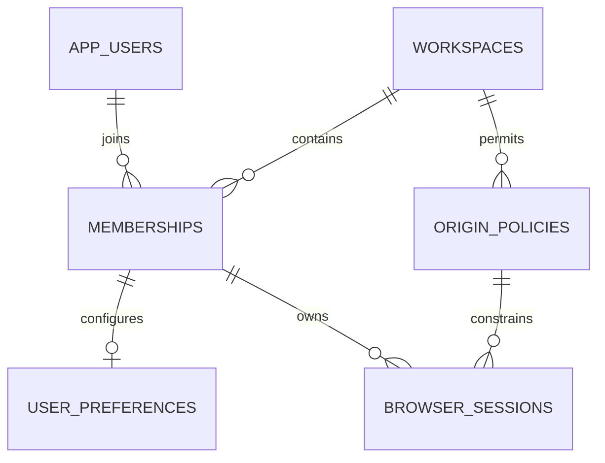
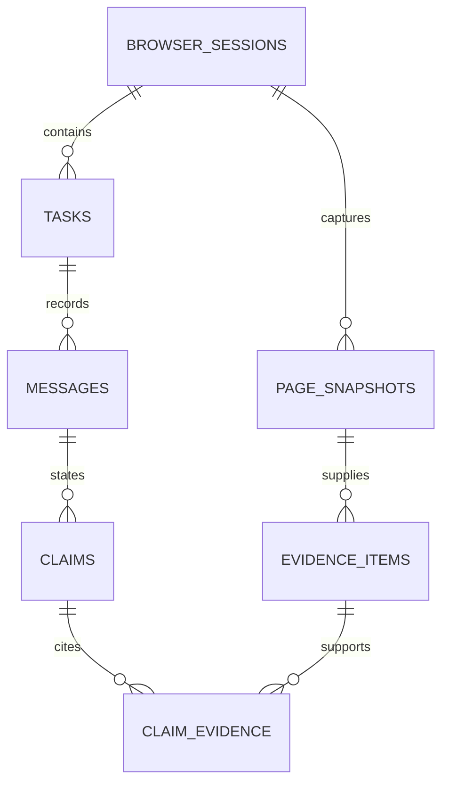
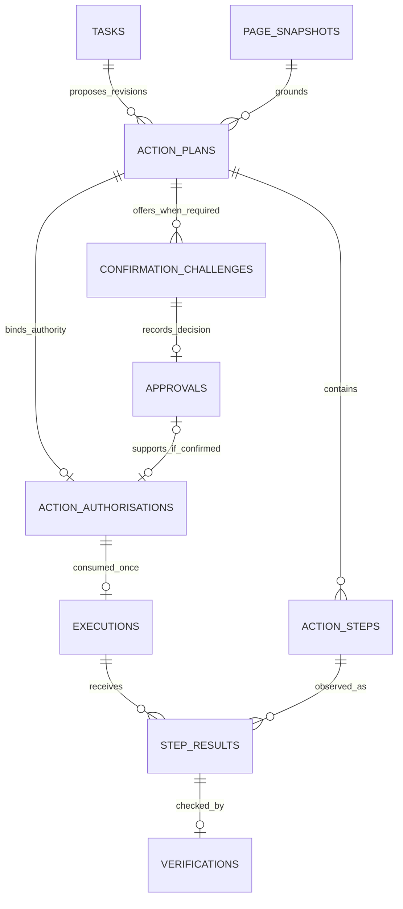

# Database specification and relationship guide

Version 2.0 · PostgreSQL 16+ reference design · 30 tables · 355 columns · 102 scoped foreign keys

## 1. Scope and source of truth

This database stores the assistant’s users, permissions, observations, grounded answers and controlled actions. It does **not** mirror arbitrary business systems, store website credentials or capture continuous screen recordings.

- `04_schema.sql`: executable-form reference DDL; authoritative for types, checks, foreign keys, uniqueness and indexes.
- `05_schema.dbml`: field-level diagram import source; paste into a DBML-compatible diagram tool. Composite relationships preserve scope. SQL is authoritative for partial indexes and checks not represented in DBML.
- `06_row_security.sql`: optional owner/tenant row-security policies; deployment grants and privileged maintenance paths still need explicit configuration.
- `07_action_lifecycle_erd.mmd`: compact action/control ERD; the domain views below explain the rest.
- `schema_model.json`: machine-readable schema model used to generate DDL, DBML and this dictionary.

This is a design artifact. The validation report distinguishes static consistency checks from a migration actually executed on PostgreSQL. Do not apply the DDL to an existing production namespace without a migration review.

## 2. Design decisions

### 2.1 Identity, tenancy and ownership

`app_users` is global and stores an identity-provider subject, not passwords. `workspaces` is the tenant root. `memberships` is the many-to-many bridge between users and workspaces. Operational tables include `workspace_id`; session-derived tables also include `session_id`, and task/action descendants carry the corresponding ancestry columns.

This denormalisation is intentional. A UUID being globally unique does not prevent a developer from linking a task to another tenant’s snapshot. Composite foreign keys require matching tenant and relevant session/task/plan ancestry. Service authorisation additionally requires the authenticated owner; foreign keys are not access control.

The ordinary member runtime must not have unrestricted access to global identity tables, tenant policy mutations or other employees’ sessions. Workspace administrators manage policies through a separate authorised route and do not automatically read conversations.

### 2.2 Typed fields versus JSONB

Use typed columns for identity, ownership, states, time, hashes, sequence numbers and relationships. Use versioned JSONB only for bounded source structure, calculations, action predicates and safe event metadata whose shape depends on the supported adapter.

SQL checks enforce JSON container type. The shared API schemas enforce allowed keys, size limits and nested value types. A JSONB object being syntactically valid does not make it a valid action or safe evidence. Do not put unlimited provider responses or arbitrary page HTML into JSONB.

### 2.3 IDs, time and numeric data

All entity IDs are UUIDs generated server-side. UTC `timestamptz` values are authoritative. Client capture/dispatch times are accepted only within a configured clock-skew window (proposed ±5 seconds) and are paired with server receipt time in the event trail. If clock skew is too large, require recapture or use server-bound freshness checks; do not trust an invented future capture time.

Human business values are represented as typed payloads with raw display string, canonical decimal string/integer, unit and parse status. Monetary values are not part of the H0 fixture. If added later, use exact decimal or integer minor units plus currency; never floating-point storage for financial arithmetic.

### 2.4 Immutable and mutable records

Snapshots, evidence and pending plan semantics are immutable except approved content erasure. Lifecycle columns such as task status, cancellation flag and execution outcome change only through the service’s guarded transitions. Approvals cannot be repointed to another plan. Idempotency records support processing-to-completed transitions.

The supplied DDL does **not** implement every state-machine transition as a database trigger. Those cross-row and temporal guards are explicitly assigned to API transactions and tests. Restrict SQL writes to the trusted service and maintenance roles. If direct client database writes are introduced, this design must be strengthened before that architecture is safe.

## 3. Domain map and cardinalities

| Domain | Principal entities | Relationship meaning |
|---|---|---|
| Identity | users, workspaces, memberships, preferences, origin policies | User ↔ workspace is many-to-many through membership; preferences unique per membership; origins unique per workspace |
| Context | browser sessions, consent grants, snapshots | One user owns many sessions; a session has many purpose grants and ordered snapshots |
| Evidence | evidence items, messages, claims, claim-evidence bridge | One snapshot has many source items; an answer has many claims; claims ↔ source items is many-to-many within a session |
| Work | tasks and progress events | One session has many tasks over time but one active task; events replay progress for one task |
| Actions | plans, steps, challenges, approvals, authorisations, executions, receipts, verifications | A plan has at most one authorisation and execution; only explicit-confirmation mode has an approval; challenges may be renewed before a decision; receipts have final verification |
| Packaging | workspace entitlements and seat assignments | One current entitlement per workspace; one current assignment per member; seat limits and management access enforced transactionally |
| Operations | model calls, feedback, audit, idempotency, outbox, deletions | Minimal usage/control records and reliable handoff; no raw audio/image archive |

### Identity and session view

### Evidence view

### Action view

A clear reversible user command may create a `direct_request` authorisation with no approval row. A rejected explicit decision creates no authorisation or execution. An approved decision can still expire or become invalid because the page, membership, policy or consent changed. Multiple plan revisions are allowed, but only one current pending plan should be offered for a task. Expire/revoke its challenges and unused authorisations when it is superseded. An Undo creates a new task/plan linked to the original same-session receipt; it cannot rewrite that historical outcome. A passed verification means the declared observable condition matched; it does not prove every hidden business effect or the correctness of the underlying business data.

## 4. Complete table and column dictionary

`NOT NULL` is required unless marked nullable. `created_at` is server creation time, not a claim that client-captured content was fresh. All tables have a UUID primary key `id`. Scope columns are listed explicitly so implementation and diagramming do not depend on hidden conventions.

### app_users

**Domain:** Identity · **Purpose:** Global identity shell. The identity provider owns passwords and MFA. No disability diagnosis is stored.

| Column | PostgreSQL type | Nullable | Default | Meaning |
|---|---|---|---|---|
| id | `uuid` | No | `gen_random_uuid()` | Immutable opaque record identifier. |
| identity_subject | `text` | No | — | Stable provider-issued subject; not an email address. |
| display_name | `text` | Yes | — | User-controlled display name. |
| status | `text` | No | — | Account lifecycle; disabled accounts cannot start sessions. |
| last_seen_at | `timestamptz` | Yes | — | Last successful authentication. |
| created_at | `timestamptz` | No | `now()` | Server-assigned creation instant in UTC. |

**Unique keys:** `(identity_subject)`

**Checks:** `status IN ('active','disabled','anonymised')`

**Query indexes:** Primary/unique indexes support initial lookups; add measured query indexes only when needed.

### workspaces

**Domain:** Identity · **Purpose:** Tenant, policy defaults and retention envelope. Workspace administrators do not automatically receive access to employee conversations.

| Column | PostgreSQL type | Nullable | Default | Meaning |
|---|---|---|---|---|
| id | `uuid` | No | `gen_random_uuid()` | Immutable opaque record identifier. |
| name | `text` | No | — | Organisation or personal workspace label. |
| status | `text` | No | — | Workspace availability. |
| policy_version | `integer` | No | `1` | Increment whenever an execution-affecting policy changes. |
| content_retention_hours | `integer` | No | `24` | Maximum persisted content lifetime; default one day. |
| audit_retention_days | `integer` | No | `30` | Metadata-only audit retention. |
| workspace_kind | `text` | No | — | Personal individual-tier or employer organisation workspace. |
| created_at | `timestamptz` | No | `now()` | Server-assigned creation instant in UTC. |

**Unique keys:** Primary key only.

**Checks:** `status IN ('active','suspended','deleting')`; `policy_version > 0`; `content_retention_hours BETWEEN 1 AND 168`; `audit_retention_days BETWEEN 1 AND 90`; `workspace_kind IN ('personal','organisation')`

**Query indexes:** Primary/unique indexes support initial lookups; add measured query indexes only when needed.

### memberships

**Domain:** Identity · **Purpose:** Tenant authorisation membership; users can belong to multiple workspaces.

| Column | PostgreSQL type | Nullable | Default | Meaning |
|---|---|---|---|---|
| id | `uuid` | No | `gen_random_uuid()` | Immutable opaque record identifier. |
| workspace_id | `uuid` | No | — | Tenant boundary; derived from authenticated server context, never trusted from page content. |
| user_id | `uuid` | No | — | Member identity. |
| role | `text` | No | — | Member or policy administrator; admin is not a transcript-reader role. |
| status | `text` | No | — | Membership state. |
| created_at | `timestamptz` | No | `now()` | Server-assigned creation instant in UTC. |

**Unique keys:** `(workspace_id, user_id)`; `(workspace_id, id)`

**Checks:** `role IN ('member','admin')`; `status IN ('active','suspended')`

**Outgoing foreign keys:**

- `(workspace_id) → workspaces(id)`; delete behaviour: CASCADE.
- `(user_id) → app_users(id)`; delete behaviour: NO ACTION.

**Query indexes:** Primary/unique indexes support initial lookups; add measured query indexes only when needed.

### user_preferences

**Domain:** Identity · **Purpose:** Per-workspace accessibility choices without requiring a medical classification.

| Column | PostgreSQL type | Nullable | Default | Meaning |
|---|---|---|---|---|
| id | `uuid` | No | `gen_random_uuid()` | Immutable opaque record identifier. |
| workspace_id | `uuid` | No | — | Tenant boundary; derived from authenticated server context, never trusted from page content. |
| user_id | `uuid` | No | — | Preference owner. |
| locale | `text` | No | — | Interface and default response language. |
| speech_mode | `text` | No | — | screen_reader suppresses application TTS; app_tts is opt-in. |
| speech_rate | `numeric(3,2)` | No | `1.00` | TTS playback multiplier. |
| contrast_mode | `text` | No | — | System or explicitly chosen theme. |
| text_scale_percent | `integer` | No | `100` | In-app text scaling; browser zoom remains supported. |
| reduced_motion | `boolean` | No | `false` | User override of system motion preference. |
| version | `integer` | No | `1` | Optimistic concurrency version. |
| updated_at | `timestamptz` | Yes | — | Last update. |
| confirmation_mode | `text` | No | — | Default reversibility-based direct scope; user can require every action to be confirmed. |
| answer_detail | `text` | No | — | Preferred explanation depth. |
| auto_return | `boolean` | No | `false` | Return focus after a completed response only when the user is not inspecting details. |
| created_at | `timestamptz` | No | `now()` | Server-assigned creation instant in UTC. |

**Unique keys:** `(workspace_id, user_id)`; `(workspace_id, id)`

**Checks:** `locale IN ('vi-VN','en-US')`; `speech_mode IN ('screen_reader','app_tts','silent')`; `contrast_mode IN ('system','light','dark','high_contrast')`; `speech_rate BETWEEN 0.5 AND 2.0`; `text_scale_percent BETWEEN 100 AND 200`; `version > 0`; `confirmation_mode IN ('reversible_direct','confirm_all')`; `answer_detail IN ('brief','detailed')`

**Outgoing foreign keys:**

- `(workspace_id) → workspaces(id)`; delete behaviour: CASCADE.
- `(workspace_id, user_id) → memberships(workspace_id, user_id)`; delete behaviour: NO ACTION.

**Query indexes:** Primary/unique indexes support initial lookups; add measured query indexes only when needed.

### origin_policies

**Domain:** Identity · **Purpose:** Exact-origin allowlist. Browser permission and product policy are separate gates.

| Column | PostgreSQL type | Nullable | Default | Meaning |
|---|---|---|---|---|
| id | `uuid` | No | `gen_random_uuid()` | Immutable opaque record identifier. |
| workspace_id | `uuid` | No | — | Tenant boundary; derived from authenticated server context, never trusted from page content. |
| origin | `text` | No | — | Canonical HTTPS scheme + host + non-default port; no path/wildcards. |
| read_allowed | `boolean` | No | `true` | Allow redacted structure upload. |
| vision_allowed | `boolean` | No | `false` | Allow separately consented visual processing. |
| action_allowed | `boolean` | No | `false` | Allow authorised supported reversible actions. |
| adapter_key | `text` | No | — | Versioned, bundled adapter identifier. |
| policy_version | `integer` | No | `1` | Revision at last policy update. |
| committed_action_allowed | `boolean` | No | `false` | Pilot-only named non-financial submit adapter gate; false in H0/H1. |
| force_confirmation | `boolean` | No | `false` | Policy can tighten the user default for reversible operations. |
| created_at | `timestamptz` | No | `now()` | Server-assigned creation instant in UTC. |

**Unique keys:** `(workspace_id, origin)`; `(workspace_id, id)`

**Checks:** `origin ~ '^https://[^/]+$'`; `policy_version > 0`

**Outgoing foreign keys:**

- `(workspace_id) → workspaces(id)`; delete behaviour: CASCADE.

**Query indexes:** Primary/unique indexes support initial lookups; add measured query indexes only when needed.

### browser_sessions

**Domain:** Context · **Purpose:** Single user and single browser-document context. New origin or revoked permission ends the session.

| Column | PostgreSQL type | Nullable | Default | Meaning |
|---|---|---|---|---|
| id | `uuid` | No | `gen_random_uuid()` | Immutable opaque record identifier. |
| workspace_id | `uuid` | No | — | Tenant boundary; derived from authenticated server context, never trusted from page content. |
| user_id | `uuid` | No | — | Session owner. |
| client_session_key | `text` | No | — | Random client correlation key; not a browser profile identifier. |
| origin | `text` | No | — | Canonical allowed origin. |
| status | `text` | No | — | Session lifecycle. |
| last_activity_at | `timestamptz` | No | — | Last accepted request. |
| expires_at | `timestamptz` | No | — | Absolute session expiry, at most two hours for H0. |
| ended_at | `timestamptz` | Yes | — | End time if ended. |
| created_at | `timestamptz` | No | `now()` | Server-assigned creation instant in UTC. |

**Unique keys:** `(workspace_id, client_session_key)`; `(workspace_id, id)`

**Checks:** `status IN ('active','paused','ended','expired')`; `expires_at > created_at`

**Outgoing foreign keys:**

- `(workspace_id) → workspaces(id)`; delete behaviour: CASCADE.
- `(workspace_id, user_id) → memberships(workspace_id, user_id)`; delete behaviour: NO ACTION.
- `(workspace_id, origin) → origin_policies(workspace_id, origin)`; delete behaviour: NO ACTION.

**Query indexes:** `(workspace_id, user_id, created_at)`

### consent_grants

**Domain:** Context · **Purpose:** Purpose-specific permission evidence. Local browser grants remain authoritative for capture.

| Column | PostgreSQL type | Nullable | Default | Meaning |
|---|---|---|---|---|
| id | `uuid` | No | `gen_random_uuid()` | Immutable opaque record identifier. |
| workspace_id | `uuid` | No | — | Tenant boundary; derived from authenticated server context, never trusted from page content. |
| session_id | `uuid` | No | — | Owning browser session; also used to enforce same-session relationships. |
| user_id | `uuid` | No | — | User who consented. |
| purpose | `text` | No | — | One grant per processing purpose. |
| notice_version | `text` | No | — | Version of the processing notice presented. |
| granted_at | `timestamptz` | No | — | Explicit user acceptance time. |
| expires_at | `timestamptz` | No | — | Cannot outlive session. |
| revoked_at | `timestamptz` | Yes | — | Revocation time. |
| created_at | `timestamptz` | No | `now()` | Server-assigned creation instant in UTC. |

**Unique keys:** `(workspace_id, id)`; `(workspace_id, session_id, id)`

**Checks:** `purpose IN ('structured_processing','voice_processing','visual_processing')`; `expires_at > granted_at`

**Outgoing foreign keys:**

- `(workspace_id) → workspaces(id)`; delete behaviour: CASCADE.
- `(workspace_id, session_id) → browser_sessions(workspace_id, id)`; delete behaviour: NO ACTION.
- `(workspace_id, user_id) → memberships(workspace_id, user_id)`; delete behaviour: NO ACTION.

**Query indexes:** `(workspace_id, session_id, purpose)`

### page_snapshots

**Domain:** Context · **Purpose:** Immutable redacted page-state observation. Payload can only be cleared by retention/deletion; no raw HTML or credentials.

| Column | PostgreSQL type | Nullable | Default | Meaning |
|---|---|---|---|---|
| id | `uuid` | No | `gen_random_uuid()` | Immutable opaque record identifier. |
| workspace_id | `uuid` | No | — | Tenant boundary; derived from authenticated server context, never trusted from page content. |
| session_id | `uuid` | No | — | Owning browser session; also used to enforce same-session relationships. |
| revision | `integer` | No | — | Monotonically increasing session-local capture number. |
| document_key | `text` | No | — | Random navigation/document identity, refreshed on navigation. |
| page_path | `text` | No | — | Redacted path only; strip query/fragment and sensitive route segments. |
| adapter_key | `text` | No | — | Bundled adapter and extraction version. |
| state_fingerprint | `text` | No | — | SHA-256 of canonical relevant state; 64 lowercase hex characters. |
| source_mode | `text` | No | — | Available grounding mode. |
| state | `jsonb` | No | `'{}'::jsonb` | Versioned redacted state: title, filters, units, selected region, control descriptors. |
| is_complete | `boolean` | No | `false` | Whether the relevant table/region is complete, not the whole website. |
| captured_at | `timestamptz` | No | — | Capture time with server clock-skew checks. |
| expires_at | `timestamptz` | No | — | Content TTL; cannot exceed workspace content-retention policy. Session expiry stops capture, not historical owner access. |
| purged_at | `timestamptz` | Yes | — | Payload deletion marker. |
| created_at | `timestamptz` | No | `now()` | Server-assigned creation instant in UTC. |

**Unique keys:** `(workspace_id, session_id, revision)`; `(workspace_id, id)`; `(workspace_id, session_id, id)`

**Checks:** `revision > 0`; `state_fingerprint ~ '^[0-9a-f]{64}$'`; `source_mode IN ('structured','visual','mixed','unavailable')`; `jsonb_typeof(state) = 'object'`; `expires_at > captured_at`

**Outgoing foreign keys:**

- `(workspace_id) → workspaces(id)`; delete behaviour: CASCADE.
- `(workspace_id, session_id) → browser_sessions(workspace_id, id)`; delete behaviour: NO ACTION.

**Query indexes:** `(expires_at)`

### evidence_items

**Domain:** Evidence · **Purpose:** Atomic, inspectable source reference. Exact values and their units are kept together; hashes alone are not readable evidence.

| Column | PostgreSQL type | Nullable | Default | Meaning |
|---|---|---|---|---|
| id | `uuid` | No | `gen_random_uuid()` | Immutable opaque record identifier. |
| workspace_id | `uuid` | No | — | Tenant boundary; derived from authenticated server context, never trusted from page content. |
| session_id | `uuid` | No | — | Owning browser session; also used to enforce same-session relationships. |
| snapshot_id | `uuid` | No | — | Snapshot that supplied this evidence. |
| kind | `text` | No | — | Evidence origin. |
| label | `text` | No | — | Accessible source label, e.g. Completed orders, South, July 2026. |
| source_pointer | `jsonb` | No | `'{}'::jsonb` | Versioned pointer: table ID + row/column keys, or selected visual region. |
| payload | `jsonb` | No | `'{}'::jsonb` | Redacted value, type, unit, raw display string and parsing status. |
| quality | `text` | No | — | Structural validation status; not a model self-confidence score. |
| expires_at | `timestamptz` | No | — | No later than parent content expiry. |
| purged_at | `timestamptz` | Yes | — | Evidence content removed; retained reference becomes unavailable. |
| created_at | `timestamptz` | No | `now()` | Server-assigned creation instant in UTC. |

**Unique keys:** `(workspace_id, id)`; `(workspace_id, session_id, id)`

**Checks:** `kind IN ('dom_table','dom_control','page_text','visual_region')`; `quality IN ('validated','partial','uncertain','conflicting')`; `jsonb_typeof(source_pointer) = 'object'`; `jsonb_typeof(payload) = 'object'`

**Outgoing foreign keys:**

- `(workspace_id) → workspaces(id)`; delete behaviour: CASCADE.
- `(workspace_id, session_id) → browser_sessions(workspace_id, id)`; delete behaviour: NO ACTION.
- `(workspace_id, session_id, snapshot_id) → page_snapshots(workspace_id, session_id, id)`; delete behaviour: NO ACTION.

**Query indexes:** `(workspace_id, session_id, snapshot_id)`; `(expires_at)`

### tasks

**Domain:** Task · **Purpose:** One accepted user intent. Sequential active-task execution per session prevents competing agents.

| Column | PostgreSQL type | Nullable | Default | Meaning |
|---|---|---|---|---|
| id | `uuid` | No | `gen_random_uuid()` | Immutable opaque record identifier. |
| workspace_id | `uuid` | No | — | Tenant boundary; derived from authenticated server context, never trusted from page content. |
| session_id | `uuid` | No | — | Owning browser session; also used to enforce same-session relationships. |
| request_text | `text` | No | — | User-confirmed text; redacted and subject to content TTL. |
| input_mode | `text` | No | — | Input source. |
| locale | `text` | No | — | Language used for this task. |
| status | `text` | No | — | Authoritative orchestration state. |
| version | `integer` | No | `1` | CAS version incremented on state changes. |
| cancel_requested | `boolean` | No | `false` | Stops future dispatches, does not imply rollback. |
| terminal_code | `text` | Yes | — | Stable machine-readable reason when stopped. |
| context_snapshot_id | `uuid` | Yes | — | Current explicitly selected grounding snapshot; nullable before first capture. |
| processing_budget_ms | `integer` | No | `90000` | Active-processing budget, excluding bounded human waiting. |
| processing_used_ms | `integer` | No | `0` | Accumulated active processing, updated under task lock. |
| processing_started_at | `timestamptz` | Yes | — | Start of current active segment, null while waiting/terminal. |
| waiting_expires_at | `timestamptz` | Yes | — | Current approval/clarification wait deadline. |
| clarification_rounds | `integer` | No | `0` | Clarification prompts already issued. |
| model_calls_used | `integer` | No | `0` | Call reservations consumed, including failed and retried calls. |
| deadline_at | `timestamptz` | No | — | Hard wall-clock task deadline, no later than session expiry. |
| content_expires_at | `timestamptz` | No | — | Lifetime of request and response content. |
| completed_at | `timestamptz` | Yes | — | Terminal timestamp. |
| created_at | `timestamptz` | No | `now()` | Server-assigned creation instant in UTC. |

**Unique keys:** `(workspace_id, id)`; `(workspace_id, session_id, id)`

**Checks:** `input_mode IN ('text','voice')`; `locale IN ('vi-VN','en-US')`; `status IN ('queued','capturing','interpreting','needs_clarification','awaiting_approval','executing','verifying','completed','partially_completed','cancelled','failed','unknown')`; `version > 0`; `processing_budget_ms > 0`; `processing_used_ms >= 0`; `clarification_rounds >= 0`; `model_calls_used >= 0`

**Outgoing foreign keys:**

- `(workspace_id) → workspaces(id)`; delete behaviour: CASCADE.
- `(workspace_id, session_id) → browser_sessions(workspace_id, id)`; delete behaviour: NO ACTION.
- `(workspace_id, session_id, context_snapshot_id) → page_snapshots(workspace_id, session_id, id)`; delete behaviour: NO ACTION.

**Query indexes:** `(workspace_id, session_id, created_at)`

### messages

**Domain:** Task · **Purpose:** Ordered user/assistant/system messages. Never store model hidden reasoning or raw provider prompts.

| Column | PostgreSQL type | Nullable | Default | Meaning |
|---|---|---|---|---|
| id | `uuid` | No | `gen_random_uuid()` | Immutable opaque record identifier. |
| workspace_id | `uuid` | No | — | Tenant boundary; derived from authenticated server context, never trusted from page content. |
| session_id | `uuid` | No | — | Owning browser session; also used to enforce same-session relationships. |
| task_id | `uuid` | No | — | Owning user request; scopes all orchestration records. |
| sequence | `integer` | No | — | Unique task-local message number. |
| role | `text` | No | — | Conversation role. |
| kind | `text` | No | — | UI component type. |
| content | `text` | No | — | Final display text; partial tokens are transient. |
| generation_id | `text` | No | — | Prevents late model responses overwriting a cancelled generation. |
| expires_at | `timestamptz` | No | — | Content retention deadline. |
| purged_at | `timestamptz` | Yes | — | Content cleared. |
| created_at | `timestamptz` | No | `now()` | Server-assigned creation instant in UTC. |

**Unique keys:** `(workspace_id, session_id, task_id, sequence)`; `(workspace_id, id)`; `(workspace_id, session_id, task_id, id)`

**Checks:** `sequence > 0`; `role IN ('user','assistant','system')`; `kind IN ('request','clarification','answer','approval_summary','status','error')`

**Outgoing foreign keys:**

- `(workspace_id) → workspaces(id)`; delete behaviour: CASCADE.
- `(workspace_id, session_id) → browser_sessions(workspace_id, id)`; delete behaviour: NO ACTION.
- `(workspace_id, session_id, task_id) → tasks(workspace_id, session_id, id)`; delete behaviour: NO ACTION.

**Query indexes:** Primary/unique indexes support initial lookups; add measured query indexes only when needed.

### claims

**Domain:** Evidence · **Purpose:** Individually checkable assertions in an answer; links to evidence and deterministic calculations.

| Column | PostgreSQL type | Nullable | Default | Meaning |
|---|---|---|---|---|
| id | `uuid` | No | `gen_random_uuid()` | Immutable opaque record identifier. |
| workspace_id | `uuid` | No | — | Tenant boundary; derived from authenticated server context, never trusted from page content. |
| session_id | `uuid` | No | — | Owning browser session; also used to enforce same-session relationships. |
| task_id | `uuid` | No | — | Owning user request; scopes all orchestration records. |
| message_id | `uuid` | No | — | Owning answer message. |
| ordinal | `integer` | No | — | Position in the answer. |
| claim_text | `text` | No | — | Human-readable assertion, cleared with parent message. |
| basis | `text` | No | — | Basis controls wording and UI label. |
| calculation | `jsonb` | No | `'{}'::jsonb` | Allowlisted operation, operands and result for derived claims; empty otherwise. |
| verification_status | `text` | No | — | Evidence usability, never a guarantee of real-world truth. |
| created_at | `timestamptz` | No | `now()` | Server-assigned creation instant in UTC. |

**Unique keys:** `(workspace_id, session_id, task_id, message_id, ordinal)`; `(workspace_id, id)`; `(workspace_id, session_id, task_id, id)`

**Checks:** `ordinal > 0`; `basis IN ('observed','computed','estimated','unknown')`; `verification_status IN ('supported','limited','conflict','expired')`; `jsonb_typeof(calculation) = 'object'`

**Outgoing foreign keys:**

- `(workspace_id) → workspaces(id)`; delete behaviour: CASCADE.
- `(workspace_id, session_id) → browser_sessions(workspace_id, id)`; delete behaviour: NO ACTION.
- `(workspace_id, session_id, task_id) → tasks(workspace_id, session_id, id)`; delete behaviour: NO ACTION.
- `(workspace_id, session_id, task_id, message_id) → messages(workspace_id, session_id, task_id, id)`; delete behaviour: NO ACTION.

**Query indexes:** Primary/unique indexes support initial lookups; add measured query indexes only when needed.

### claim_evidence

**Domain:** Evidence · **Purpose:** Many-to-many citation bridge; a claim may use several sources and one source may support several claims.

| Column | PostgreSQL type | Nullable | Default | Meaning |
|---|---|---|---|---|
| id | `uuid` | No | `gen_random_uuid()` | Immutable opaque record identifier. |
| workspace_id | `uuid` | No | — | Tenant boundary; derived from authenticated server context, never trusted from page content. |
| session_id | `uuid` | No | — | Owning browser session; also used to enforce same-session relationships. |
| task_id | `uuid` | No | — | Owning user request; scopes all orchestration records. |
| claim_id | `uuid` | No | — | Assertion receiving a citation. |
| evidence_id | `uuid` | No | — | Inspectable source from the same browser session. |
| relation | `text` | No | — | How the source is used. |
| ordinal | `integer` | No | — | Citation display order. |
| created_at | `timestamptz` | No | `now()` | Server-assigned creation instant in UTC. |

**Unique keys:** `(workspace_id, claim_id, evidence_id, relation)`; `(workspace_id, id)`; `(workspace_id, session_id, task_id, id)`

**Checks:** `relation IN ('supports','operand','contradicts')`; `ordinal > 0`

**Outgoing foreign keys:**

- `(workspace_id) → workspaces(id)`; delete behaviour: CASCADE.
- `(workspace_id, session_id) → browser_sessions(workspace_id, id)`; delete behaviour: NO ACTION.
- `(workspace_id, session_id, task_id) → tasks(workspace_id, session_id, id)`; delete behaviour: NO ACTION.
- `(workspace_id, session_id, task_id, claim_id) → claims(workspace_id, session_id, task_id, id)`; delete behaviour: NO ACTION.
- `(workspace_id, session_id, evidence_id) → evidence_items(workspace_id, session_id, id)`; delete behaviour: NO ACTION.

**Query indexes:** Primary/unique indexes support initial lookups; add measured query indexes only when needed.

### action_plans

**Domain:** Action · **Purpose:** Immutable grounded plan revision. Direct reversible intent or a challenge-bound confirmation can authorise it; committed actions always need explicit confirmation.

| Column | PostgreSQL type | Nullable | Default | Meaning |
|---|---|---|---|---|
| id | `uuid` | No | `gen_random_uuid()` | Immutable opaque record identifier. |
| workspace_id | `uuid` | No | — | Tenant boundary; derived from authenticated server context, never trusted from page content. |
| session_id | `uuid` | No | — | Owning browser session; also used to enforce same-session relationships. |
| task_id | `uuid` | No | — | Owning user request; scopes all orchestration records. |
| revision | `integer` | No | — | Task-local plan revision. |
| base_snapshot_id | `uuid` | No | — | Snapshot on which the plan was grounded. |
| plan_hash | `text` | No | — | SHA-256 of canonical signed-scope payload. |
| policy_version | `integer` | No | — | Workspace policy version bound into plan authority. |
| summary | `text` | No | — | Accessible plain-language read-back of targets and effects. |
| risk_class | `text` | No | — | H0 supports reversible-only plans. |
| status | `text` | No | — | Plan progression. |
| expires_at | `timestamptz` | No | — | Plan validity window: 120 seconds maximum for H0; a confirmation challenge has a shorter window. |
| superseded_at | `timestamptz` | Yes | — | Set when a new revision replaces this one. |
| authorisation_mode | `text` | No | — | How the exact plan must be authorised. |
| plan_kind | `text` | No | — | Normal request or guarded restoration of an earlier step. |
| reverses_step_result_id | `uuid` | Yes | — | Original same-session step result; non-null only for an undo plan. |
| descriptor_hash | `text` | No | — | Digest of the locally resolved actual pending-action descriptor, bound into authorisation. |
| created_at | `timestamptz` | No | `now()` | Server-assigned creation instant in UTC. |

**Unique keys:** `(workspace_id, session_id, task_id, revision)`; `(workspace_id, id)`; `(workspace_id, session_id, task_id, id)`

**Checks:** `revision > 0`; `policy_version > 0`; `plan_hash ~ '^[0-9a-f]{64}$'`; `risk_class IN ('reversible','committed','prohibited')`; `status IN ('draft','pending','approved','authorised','rejected','superseded','expired','executing','finished')`; `authorisation_mode IN ('direct_request','explicit_confirmation')`; `plan_kind IN ('normal','undo')`; `descriptor_hash ~ '^[0-9a-f]{64}$'`; `(plan_kind = 'normal' AND reverses_step_result_id IS NULL) OR (plan_kind = 'undo' AND reverses_step_result_id IS NOT NULL)`

**Outgoing foreign keys:**

- `(workspace_id) → workspaces(id)`; delete behaviour: CASCADE.
- `(workspace_id, session_id) → browser_sessions(workspace_id, id)`; delete behaviour: NO ACTION.
- `(workspace_id, session_id, task_id) → tasks(workspace_id, session_id, id)`; delete behaviour: NO ACTION.
- `(workspace_id, session_id, base_snapshot_id) → page_snapshots(workspace_id, session_id, id)`; delete behaviour: NO ACTION.
- `(workspace_id, session_id, reverses_step_result_id) → step_results(workspace_id, session_id, id)`; delete behaviour: NO ACTION.

**Query indexes:** Primary/unique indexes support initial lookups; add measured query indexes only when needed.

### action_steps

**Domain:** Action · **Purpose:** Ordered allowlisted actions with explicit preconditions and observable expected effects.

| Column | PostgreSQL type | Nullable | Default | Meaning |
|---|---|---|---|---|
| id | `uuid` | No | `gen_random_uuid()` | Immutable opaque record identifier. |
| workspace_id | `uuid` | No | — | Tenant boundary; derived from authenticated server context, never trusted from page content. |
| session_id | `uuid` | No | — | Owning browser session; also used to enforce same-session relationships. |
| task_id | `uuid` | No | — | Owning user request; scopes all orchestration records. |
| plan_id | `uuid` | No | — | Immutable action-plan revision that owns this record. |
| ordinal | `integer` | No | — | Execution order, one to three in H0. |
| verb | `text` | No | — | Packaged executor operation; not JavaScript generated by a model. |
| target | `jsonb` | No | `'{}'::jsonb` | Adapter key + opaque element handle + semantic identity. |
| arguments | `jsonb` | No | `'{}'::jsonb` | Validated verb-specific arguments. |
| precondition | `jsonb` | No | `'{}'::jsonb` | Current document and relevant-state predicate. |
| expected_effect | `jsonb` | No | `'{}'::jsonb` | Observable condition after action. |
| timeout_ms | `integer` | No | `10000` | Step deadline, including post-action settle time. |
| pending_descriptor | `jsonb` | No | `'{}'::jsonb` | Adapter-observed destination, control identity, current/proposed values and actual dispatch operation. |
| undo_spec | `jsonb` | No | `'{}'::jsonb` | Versioned inverse operation and before/after guards; empty if not safely reversible. Content TTL applies. |
| created_at | `timestamptz` | No | `now()` | Server-assigned creation instant in UTC. |

**Unique keys:** `(workspace_id, plan_id, ordinal)`; `(workspace_id, id)`; `(workspace_id, session_id, task_id, plan_id, id)`

**Checks:** `ordinal BETWEEN 1 AND 20`; `verb IN ('focus','navigate_same_origin','set_filter','sort_table','fill_draft','commit_submit')`; `jsonb_typeof(target) = 'object'`; `jsonb_typeof(arguments) = 'object'`; `jsonb_typeof(precondition) = 'object'`; `jsonb_typeof(expected_effect) = 'object'`; `timeout_ms BETWEEN 1000 AND 30000`; `jsonb_typeof(pending_descriptor) = 'object'`; `jsonb_typeof(undo_spec) = 'object'`

**Outgoing foreign keys:**

- `(workspace_id) → workspaces(id)`; delete behaviour: CASCADE.
- `(workspace_id, session_id) → browser_sessions(workspace_id, id)`; delete behaviour: NO ACTION.
- `(workspace_id, session_id, task_id) → tasks(workspace_id, session_id, id)`; delete behaviour: NO ACTION.
- `(workspace_id, session_id, task_id, plan_id) → action_plans(workspace_id, session_id, task_id, id)`; delete behaviour: NO ACTION.

**Query indexes:** Primary/unique indexes support initial lookups; add measured query indexes only when needed.

### approvals

**Domain:** Action · **Purpose:** Explicit human decision only. Voice replies require an armed current challenge; direct reversible commands do not fabricate an approval row.

| Column | PostgreSQL type | Nullable | Default | Meaning |
|---|---|---|---|---|
| id | `uuid` | No | `gen_random_uuid()` | Immutable opaque record identifier. |
| workspace_id | `uuid` | No | — | Tenant boundary; derived from authenticated server context, never trusted from page content. |
| session_id | `uuid` | No | — | Owning browser session; also used to enforce same-session relationships. |
| task_id | `uuid` | No | — | Owning user request; scopes all orchestration records. |
| plan_id | `uuid` | No | — | Immutable action-plan revision that owns this record. |
| user_id | `uuid` | No | — | Approving session owner. |
| decision | `text` | No | — | Explicit approval, rejection or later revocation. |
| approved_plan_hash | `text` | No | — | Exact digest read back and approved. |
| method | `text` | No | — | Trusted extension decision control; voice intent alone is insufficient in H0. |
| decided_at | `timestamptz` | No | — | Server receipt of explicit decision. |
| expires_at | `timestamptz` | No | — | No later than plan/session expiry. |
| challenge_id | `uuid` | No | — | Current challenge consumed by this explicit decision. |
| created_at | `timestamptz` | No | `now()` | Server-assigned creation instant in UTC. |

**Unique keys:** `(workspace_id, plan_id)`; `(workspace_id, id)`; `(workspace_id, session_id, task_id, plan_id, id)`; `(workspace_id, challenge_id)`

**Checks:** `decision IN ('approved','rejected','revoked')`; `method IN ('keyboard','pointer','voice')`; `approved_plan_hash ~ '^[0-9a-f]{64}$'`; `expires_at > decided_at`

**Outgoing foreign keys:**

- `(workspace_id) → workspaces(id)`; delete behaviour: CASCADE.
- `(workspace_id, session_id) → browser_sessions(workspace_id, id)`; delete behaviour: NO ACTION.
- `(workspace_id, session_id, task_id) → tasks(workspace_id, session_id, id)`; delete behaviour: NO ACTION.
- `(workspace_id, session_id, task_id, plan_id) → action_plans(workspace_id, session_id, task_id, id)`; delete behaviour: NO ACTION.
- `(workspace_id, user_id) → memberships(workspace_id, user_id)`; delete behaviour: NO ACTION.
- `(workspace_id, session_id, task_id, plan_id, challenge_id) → confirmation_challenges(workspace_id, session_id, task_id, plan_id, id)`; delete behaviour: NO ACTION.

**Query indexes:** Primary/unique indexes support initial lookups; add measured query indexes only when needed.

### executions

**Domain:** Action · **Purpose:** One execution per plan/authorisation. External exactly-once effects are not promised; local dispatch receipts and unknown outcomes remain mandatory.

| Column | PostgreSQL type | Nullable | Default | Meaning |
|---|---|---|---|---|
| id | `uuid` | No | `gen_random_uuid()` | Immutable opaque record identifier. |
| workspace_id | `uuid` | No | — | Tenant boundary; derived from authenticated server context, never trusted from page content. |
| session_id | `uuid` | No | — | Owning browser session; also used to enforce same-session relationships. |
| task_id | `uuid` | No | — | Owning user request; scopes all orchestration records. |
| plan_id | `uuid` | No | — | Immutable action-plan revision that owns this record. |
| authorisation_id | `uuid` | No | — | Bounded authority consumed for this execution; explicit approval is reachable through it when required. |
| status | `text` | No | — | Execution lifecycle. |
| dispatch_nonce | `text` | No | — | Random one-use execution token, stored as a digest, not a bearer secret. |
| lease_expires_at | `timestamptz` | No | — | Client claim must complete before this deadline. |
| started_at | `timestamptz` | Yes | — | First dispatch time. |
| finished_at | `timestamptz` | Yes | — | Terminal time. |
| created_at | `timestamptz` | No | `now()` | Server-assigned creation instant in UTC. |

**Unique keys:** `(workspace_id, plan_id)`; `(workspace_id, authorisation_id)`; `(workspace_id, id)`; `(workspace_id, session_id, task_id, plan_id, id)`; `(workspace_id, session_id, task_id, id)`

**Checks:** `status IN ('created','leased','running','verifying','succeeded','partial','cancelled','failed','unknown')`

**Outgoing foreign keys:**

- `(workspace_id) → workspaces(id)`; delete behaviour: CASCADE.
- `(workspace_id, session_id) → browser_sessions(workspace_id, id)`; delete behaviour: NO ACTION.
- `(workspace_id, session_id, task_id) → tasks(workspace_id, session_id, id)`; delete behaviour: NO ACTION.
- `(workspace_id, session_id, task_id, plan_id) → action_plans(workspace_id, session_id, task_id, id)`; delete behaviour: NO ACTION.
- `(workspace_id, session_id, task_id, plan_id, authorisation_id) → action_authorisations(workspace_id, session_id, task_id, plan_id, id)`; delete behaviour: NO ACTION.

**Query indexes:** Primary/unique indexes support initial lookups; add measured query indexes only when needed.

### step_results

**Domain:** Action · **Purpose:** Durable receipt for each step. No blind replay if a receipt is lost after a possible side effect.

| Column | PostgreSQL type | Nullable | Default | Meaning |
|---|---|---|---|---|
| id | `uuid` | No | `gen_random_uuid()` | Immutable opaque record identifier. |
| workspace_id | `uuid` | No | — | Tenant boundary; derived from authenticated server context, never trusted from page content. |
| session_id | `uuid` | No | — | Owning browser session; also used to enforce same-session relationships. |
| task_id | `uuid` | No | — | Owning user request; scopes all orchestration records. |
| plan_id | `uuid` | No | — | Immutable action-plan revision that owns this record. |
| execution_id | `uuid` | No | — | Single execution attempt for the authorised plan. |
| step_id | `uuid` | No | — | Step from this exact plan. |
| status | `text` | No | — | Dispatch/result classification. |
| before_snapshot_id | `uuid` | Yes | — | Fresh relevant-state snapshot before dispatch. |
| after_snapshot_id | `uuid` | Yes | — | Fresh observation after dispatch. |
| client_receipt_key | `text` | No | — | Client idempotency identity persisted before action. |
| error_code | `text` | Yes | — | Stable failure or ambiguity code. |
| dispatched_at | `timestamptz` | Yes | — | Dispatch instant. |
| finished_at | `timestamptz` | Yes | — | Response/timeout instant. |
| recovery_status | `text` | No | — | Whether a verified effect currently has a usable inverse. |
| undo_expires_at | `timestamptz` | Yes | — | Inverse availability deadline, no later than content expiry. |
| created_at | `timestamptz` | No | `now()` | Server-assigned creation instant in UTC. |

**Unique keys:** `(workspace_id, execution_id, step_id)`; `(workspace_id, client_receipt_key)`; `(workspace_id, id)`; `(workspace_id, session_id, task_id, plan_id, execution_id, id)`; `(workspace_id, session_id, id)`

**Checks:** `status IN ('pending','dispatched','observed','failed','cancelled','unknown')`; `recovery_status IN ('not_available','available','requested','restored','expired','unknown')`

**Outgoing foreign keys:**

- `(workspace_id) → workspaces(id)`; delete behaviour: CASCADE.
- `(workspace_id, session_id) → browser_sessions(workspace_id, id)`; delete behaviour: NO ACTION.
- `(workspace_id, session_id, task_id) → tasks(workspace_id, session_id, id)`; delete behaviour: NO ACTION.
- `(workspace_id, session_id, task_id, plan_id) → action_plans(workspace_id, session_id, task_id, id)`; delete behaviour: NO ACTION.
- `(workspace_id, session_id, task_id, plan_id, execution_id) → executions(workspace_id, session_id, task_id, plan_id, id)`; delete behaviour: NO ACTION.
- `(workspace_id, session_id, task_id, plan_id, step_id) → action_steps(workspace_id, session_id, task_id, plan_id, id)`; delete behaviour: NO ACTION.
- `(workspace_id, session_id, before_snapshot_id) → page_snapshots(workspace_id, session_id, id)`; delete behaviour: NO ACTION.
- `(workspace_id, session_id, after_snapshot_id) → page_snapshots(workspace_id, session_id, id)`; delete behaviour: NO ACTION.

**Query indexes:** Primary/unique indexes support initial lookups; add measured query indexes only when needed.

### verifications

**Domain:** Action · **Purpose:** One final structured verification per step result. A new inspection is a new task, not rewriting history.

| Column | PostgreSQL type | Nullable | Default | Meaning |
|---|---|---|---|---|
| id | `uuid` | No | `gen_random_uuid()` | Immutable opaque record identifier. |
| workspace_id | `uuid` | No | — | Tenant boundary; derived from authenticated server context, never trusted from page content. |
| session_id | `uuid` | No | — | Owning browser session; also used to enforce same-session relationships. |
| task_id | `uuid` | No | — | Owning user request; scopes all orchestration records. |
| plan_id | `uuid` | No | — | Immutable action-plan revision that owns this record. |
| execution_id | `uuid` | No | — | Single execution attempt for the authorised plan. |
| step_result_id | `uuid` | No | — | Receipt being evaluated. |
| outcome | `text` | No | — | Comparison of observed state and explicit expected effect. |
| checks | `jsonb` | No | `'{}'::jsonb` | Named checks with expected, observed, source IDs and pass/fail/unknown. |
| summary | `text` | No | — | Accessible result and any unresolved uncertainty. |
| verified_at | `timestamptz` | No | — | Time of verification. |
| created_at | `timestamptz` | No | `now()` | Server-assigned creation instant in UTC. |

**Unique keys:** `(workspace_id, step_result_id)`; `(workspace_id, id)`; `(workspace_id, session_id, task_id, plan_id, execution_id, id)`

**Checks:** `outcome IN ('pass','fail','unknown')`; `jsonb_typeof(checks) = 'object'`

**Outgoing foreign keys:**

- `(workspace_id) → workspaces(id)`; delete behaviour: CASCADE.
- `(workspace_id, session_id) → browser_sessions(workspace_id, id)`; delete behaviour: NO ACTION.
- `(workspace_id, session_id, task_id) → tasks(workspace_id, session_id, id)`; delete behaviour: NO ACTION.
- `(workspace_id, session_id, task_id, plan_id) → action_plans(workspace_id, session_id, task_id, id)`; delete behaviour: NO ACTION.
- `(workspace_id, session_id, task_id, plan_id, execution_id) → executions(workspace_id, session_id, task_id, plan_id, id)`; delete behaviour: NO ACTION.
- `(workspace_id, session_id, task_id, plan_id, execution_id, step_result_id) → step_results(workspace_id, session_id, task_id, plan_id, execution_id, id)`; delete behaviour: NO ACTION.

**Query indexes:** Primary/unique indexes support initial lookups; add measured query indexes only when needed.

### task_events

**Domain:** Operations · **Purpose:** Replayable progress stream. No raw page data in operational events.

| Column | PostgreSQL type | Nullable | Default | Meaning |
|---|---|---|---|---|
| id | `uuid` | No | `gen_random_uuid()` | Immutable opaque record identifier. |
| workspace_id | `uuid` | No | — | Tenant boundary; derived from authenticated server context, never trusted from page content. |
| session_id | `uuid` | No | — | Owning browser session; also used to enforce same-session relationships. |
| task_id | `uuid` | No | — | Owning user request; scopes all orchestration records. |
| event_sequence | `bigint` | No | `nextval('va.event_sequence')` | Globally monotonic event cursor; gaps are valid. |
| event_type | `text` | No | — | Versioned public event type. |
| payload | `jsonb` | No | `'{}'::jsonb` | Small typed status payload; IDs and codes only. |
| created_at | `timestamptz` | No | `now()` | Server-assigned creation instant in UTC. |

**Unique keys:** `(event_sequence)`; `(workspace_id, id)`; `(workspace_id, session_id, task_id, id)`

**Checks:** `jsonb_typeof(payload) = 'object'`

**Outgoing foreign keys:**

- `(workspace_id) → workspaces(id)`; delete behaviour: CASCADE.
- `(workspace_id, session_id) → browser_sessions(workspace_id, id)`; delete behaviour: NO ACTION.
- `(workspace_id, session_id, task_id) → tasks(workspace_id, session_id, id)`; delete behaviour: NO ACTION.

**Query indexes:** `(workspace_id, task_id, event_sequence)`

### model_calls

**Domain:** Operations · **Purpose:** Provider usage and schema-validation outcome without prompt/completion logging.

| Column | PostgreSQL type | Nullable | Default | Meaning |
|---|---|---|---|---|
| id | `uuid` | No | `gen_random_uuid()` | Immutable opaque record identifier. |
| workspace_id | `uuid` | No | — | Tenant boundary; derived from authenticated server context, never trusted from page content. |
| session_id | `uuid` | No | — | Owning browser session; also used to enforce same-session relationships. |
| task_id | `uuid` | No | — | Owning user request; scopes all orchestration records. |
| provider | `text` | No | — | Configured provider alias. |
| model | `text` | No | — | Exact deployment/version identifier. |
| purpose | `text` | No | — | Intent, grounded answer, plan proposal or vision. |
| status | `text` | No | — | Provider/validation result. |
| input_tokens | `integer` | Yes | — | Reported usage; nullable when unavailable. |
| output_tokens | `integer` | Yes | — | Reported usage; nullable when unavailable. |
| latency_ms | `integer` | No | — | Measured end-to-end provider latency. |
| estimated_cost_usd | `numeric(12,6)` | Yes | — | Computed from configured dated rate card; null when unknown. |
| rate_card_version | `text` | Yes | — | Version of configured pricing, never an inferred live price. |
| created_at | `timestamptz` | No | `now()` | Server-assigned creation instant in UTC. |

**Unique keys:** `(workspace_id, id)`; `(workspace_id, session_id, task_id, id)`

**Checks:** `status IN ('started','succeeded','failed','timeout','invalid_output','cancelled')`; `input_tokens >= 0`; `output_tokens >= 0`; `latency_ms >= 0`; `estimated_cost_usd >= 0`

**Outgoing foreign keys:**

- `(workspace_id) → workspaces(id)`; delete behaviour: CASCADE.
- `(workspace_id, session_id) → browser_sessions(workspace_id, id)`; delete behaviour: NO ACTION.
- `(workspace_id, session_id, task_id) → tasks(workspace_id, session_id, id)`; delete behaviour: NO ACTION.

**Query indexes:** Primary/unique indexes support initial lookups; add measured query indexes only when needed.

### feedback

**Domain:** Operations · **Purpose:** Voluntary task feedback; no diagnosis and no implied consent to store raw recordings.

| Column | PostgreSQL type | Nullable | Default | Meaning |
|---|---|---|---|---|
| id | `uuid` | No | `gen_random_uuid()` | Immutable opaque record identifier. |
| workspace_id | `uuid` | No | — | Tenant boundary; derived from authenticated server context, never trusted from page content. |
| session_id | `uuid` | No | — | Owning browser session; also used to enforce same-session relationships. |
| task_id | `uuid` | No | — | Owning user request; scopes all orchestration records. |
| user_id | `uuid` | No | — | Feedback author. |
| outcome | `text` | No | — | User-reported usefulness. |
| reason | `text` | Yes | — | Optional categorical reason. |
| comment | `text` | Yes | — | Optional redacted comment, content TTL applies. |
| created_at | `timestamptz` | No | `now()` | Server-assigned creation instant in UTC. |

**Unique keys:** `(workspace_id, task_id, user_id)`; `(workspace_id, id)`; `(workspace_id, session_id, task_id, id)`

**Checks:** `outcome IN ('helpful','partly_helpful','not_helpful')`

**Outgoing foreign keys:**

- `(workspace_id) → workspaces(id)`; delete behaviour: CASCADE.
- `(workspace_id, session_id) → browser_sessions(workspace_id, id)`; delete behaviour: NO ACTION.
- `(workspace_id, session_id, task_id) → tasks(workspace_id, session_id, id)`; delete behaviour: NO ACTION.
- `(workspace_id, user_id) → memberships(workspace_id, user_id)`; delete behaviour: NO ACTION.

**Query indexes:** Primary/unique indexes support initial lookups; add measured query indexes only when needed.

### audit_events

**Domain:** Operations · **Purpose:** Append-only minimal security/control metadata, not employee activity analytics.

| Column | PostgreSQL type | Nullable | Default | Meaning |
|---|---|---|---|---|
| id | `uuid` | No | `gen_random_uuid()` | Immutable opaque record identifier. |
| workspace_id | `uuid` | No | — | Tenant boundary; derived from authenticated server context, never trusted from page content. |
| actor_user_id | `uuid` | Yes | — | Authenticated actor; nullable for system event. |
| event_type | `text` | No | — | Allowlisted security/control event. |
| resource_type | `text` | No | — | Logical object type. |
| resource_id | `uuid` | Yes | — | Opaque reference retained after content purge. |
| request_id | `text` | No | — | Correlation ID. |
| metadata | `jsonb` | No | `'{}'::jsonb` | IDs, result codes and policy versions only; no transcript, URL path, values or secrets. |
| created_at | `timestamptz` | No | `now()` | Server-assigned creation instant in UTC. |

**Unique keys:** `(workspace_id, id)`

**Checks:** `jsonb_typeof(metadata) = 'object'`

**Outgoing foreign keys:**

- `(workspace_id) → workspaces(id)`; delete behaviour: CASCADE.
- `(actor_user_id) → app_users(id)`; delete behaviour: NO ACTION.

**Query indexes:** `(workspace_id, created_at)`

### idempotency_records

**Domain:** Operations · **Purpose:** Server response cache for mutating commands. Keys are scoped to actor and route, not globally.

| Column | PostgreSQL type | Nullable | Default | Meaning |
|---|---|---|---|---|
| id | `uuid` | No | `gen_random_uuid()` | Immutable opaque record identifier. |
| workspace_id | `uuid` | No | — | Tenant boundary; derived from authenticated server context, never trusted from page content. |
| user_id | `uuid` | No | — | Authenticated request actor. |
| route_key | `text` | No | — | Canonical API operation name. |
| idempotency_key | `text` | No | — | Client UUID string for a logical request. |
| request_hash | `text` | No | — | SHA-256 of canonical request body. |
| status | `text` | No | — | In-progress requests are guarded by transaction locks; unresolved results become unknown. |
| response_code | `integer` | Yes | — | Stored HTTP result. |
| response_body | `jsonb` | No | `'{}'::jsonb` | IDs/codes only; never user content. |
| expires_at | `timestamptz` | No | — | 24-hour deduplication window. |
| created_at | `timestamptz` | No | `now()` | Server-assigned creation instant in UTC. |

**Unique keys:** `(workspace_id, user_id, route_key, idempotency_key)`; `(workspace_id, id)`

**Checks:** `status IN ('in_progress','completed','unknown')`; `request_hash ~ '^[0-9a-f]{64}$'`; `jsonb_typeof(response_body) = 'object'`

**Outgoing foreign keys:**

- `(workspace_id) → workspaces(id)`; delete behaviour: CASCADE.
- `(workspace_id, user_id) → memberships(workspace_id, user_id)`; delete behaviour: NO ACTION.

**Query indexes:** `(expires_at)`

### outbox_commands

**Domain:** Operations · **Purpose:** Transactional handoff from authorised server execution to browser client. Leasing does not allow duplicate side effects.

| Column | PostgreSQL type | Nullable | Default | Meaning |
|---|---|---|---|---|
| id | `uuid` | No | `gen_random_uuid()` | Immutable opaque record identifier. |
| workspace_id | `uuid` | No | — | Tenant boundary; derived from authenticated server context, never trusted from page content. |
| session_id | `uuid` | No | — | Owning browser session; also used to enforce same-session relationships. |
| task_id | `uuid` | No | — | Owning user request; scopes all orchestration records. |
| execution_id | `uuid` | No | — | Execution awaiting client claim. |
| status | `text` | No | — | Delivery lifecycle. |
| payload | `jsonb` | No | `'{}'::jsonb` | Execution identifier and token digest; no arbitrary model-generated code. |
| attempts | `integer` | No | `0` | Transport delivery attempts, not action retries. |
| available_at | `timestamptz` | No | — | Earliest delivery time. |
| lease_expires_at | `timestamptz` | Yes | — | Worker lease expiry. |
| delivered_at | `timestamptz` | Yes | — | Client receipt time. |
| created_at | `timestamptz` | No | `now()` | Server-assigned creation instant in UTC. |

**Unique keys:** `(workspace_id, execution_id)`; `(workspace_id, id)`; `(workspace_id, session_id, task_id, id)`

**Checks:** `status IN ('pending','leased','delivered','cancelled','dead')`; `jsonb_typeof(payload) = 'object'`; `attempts >= 0`

**Outgoing foreign keys:**

- `(workspace_id) → workspaces(id)`; delete behaviour: CASCADE.
- `(workspace_id, session_id) → browser_sessions(workspace_id, id)`; delete behaviour: NO ACTION.
- `(workspace_id, session_id, task_id) → tasks(workspace_id, session_id, id)`; delete behaviour: NO ACTION.
- `(workspace_id, session_id, task_id, execution_id) → executions(workspace_id, session_id, task_id, id)`; delete behaviour: NO ACTION.

**Query indexes:** `(status, available_at)`

### deletion_requests

**Domain:** Operations · **Purpose:** Tracks user-requested erasure across database content and derived stores. H0 can expose session deletion without a separate admin UI.

| Column | PostgreSQL type | Nullable | Default | Meaning |
|---|---|---|---|---|
| id | `uuid` | No | `gen_random_uuid()` | Immutable opaque record identifier. |
| workspace_id | `uuid` | No | — | Tenant boundary; derived from authenticated server context, never trusted from page content. |
| user_id | `uuid` | No | — | Requesting account. |
| session_id | `uuid` | Yes | — | Session to clear; null for all content owned by this user. |
| scope | `text` | No | — | Session or all own content. |
| status | `text` | No | — | Erasure workflow. |
| requested_at | `timestamptz` | No | — | Request accepted at. |
| deadline_at | `timestamptz` | No | — | 24-hour active-store erasure deadline. |
| completed_at | `timestamptz` | Yes | — | All active-store steps confirmed. |
| progress | `jsonb` | No | `'{}'::jsonb` | Store-specific completion counters, no raw content. |
| created_at | `timestamptz` | No | `now()` | Server-assigned creation instant in UTC. |

**Unique keys:** `(workspace_id, id)`

**Checks:** `scope IN ('session','user_content')`; `status IN ('queued','running','completed','failed')`; `(scope = 'session' AND session_id IS NOT NULL) OR (scope = 'user_content' AND session_id IS NULL)`; `jsonb_typeof(progress) = 'object'`

**Outgoing foreign keys:**

- `(workspace_id) → workspaces(id)`; delete behaviour: CASCADE.
- `(workspace_id, user_id) → memberships(workspace_id, user_id)`; delete behaviour: NO ACTION.
- `(workspace_id, session_id) → browser_sessions(workspace_id, id)`; delete behaviour: NO ACTION.

**Query indexes:** Primary/unique indexes support initial lookups; add measured query indexes only when needed.

### confirmation_challenges

**Domain:** Action · **Purpose:** One-use server challenge for a displayed/read action descriptor, independent of speech transcription.

| Column | PostgreSQL type | Nullable | Default | Meaning |
|---|---|---|---|---|
| id | `uuid` | No | `gen_random_uuid()` | Immutable opaque record identifier. |
| workspace_id | `uuid` | No | — | Tenant boundary; derived from authenticated server context, never trusted from page content. |
| session_id | `uuid` | No | — | Owning browser session; also used to enforce same-session relationships. |
| task_id | `uuid` | No | — | Owning user request; scopes all orchestration records. |
| plan_id | `uuid` | No | — | Immutable action-plan revision that owns this record. |
| user_id | `uuid` | No | — | Session owner asked to confirm. |
| nonce_hash | `text` | No | — | Digest of a fresh random challenge nonce. |
| descriptor_hash | `text` | No | — | Exact actual-action descriptor shown/read to the user. |
| status | `text` | No | — | Challenge lifecycle. |
| expires_at | `timestamptz` | No | — | No later than plan/session expiry; proposed maximum 30 seconds after read-back. |
| consumed_at | `timestamptz` | Yes | — | Decision acceptance time. |
| created_at | `timestamptz` | No | `now()` | Server-assigned creation instant in UTC. |

**Unique keys:** `(workspace_id, nonce_hash)`; `(workspace_id, id)`; `(workspace_id, session_id, task_id, plan_id, id)`

**Checks:** `status IN ('pending','consumed','revoked','expired')`; `nonce_hash ~ '^[0-9a-f]{64}$'`; `descriptor_hash ~ '^[0-9a-f]{64}$'`; `expires_at > created_at`

**Outgoing foreign keys:**

- `(workspace_id) → workspaces(id)`; delete behaviour: CASCADE.
- `(workspace_id, session_id) → browser_sessions(workspace_id, id)`; delete behaviour: NO ACTION.
- `(workspace_id, session_id, task_id) → tasks(workspace_id, session_id, id)`; delete behaviour: NO ACTION.
- `(workspace_id, session_id, task_id, plan_id) → action_plans(workspace_id, session_id, task_id, id)`; delete behaviour: NO ACTION.
- `(workspace_id, user_id) → memberships(workspace_id, user_id)`; delete behaviour: NO ACTION.

**Query indexes:** Primary/unique indexes support initial lookups; add measured query indexes only when needed.

### action_authorisations

**Domain:** Action · **Purpose:** One durable authority record per exact plan, from an explicit user request or challenge-bound confirmation.

| Column | PostgreSQL type | Nullable | Default | Meaning |
|---|---|---|---|---|
| id | `uuid` | No | `gen_random_uuid()` | Immutable opaque record identifier. |
| workspace_id | `uuid` | No | — | Tenant boundary; derived from authenticated server context, never trusted from page content. |
| session_id | `uuid` | No | — | Owning browser session; also used to enforce same-session relationships. |
| task_id | `uuid` | No | — | Owning user request; scopes all orchestration records. |
| plan_id | `uuid` | No | — | Immutable action-plan revision that owns this record. |
| user_id | `uuid` | No | — | Owning user granting the bounded authority. |
| mode | `text` | No | — | Direct reversible request or explicit confirmation. |
| source_message_id | `uuid` | No | — | Original user request that bounds task intent; must be a user message by service validation. |
| approval_id | `uuid` | Yes | — | Required for explicit-confirmation mode and null for direct mode. |
| plan_hash | `text` | No | — | Digest of exact immutable authorised plan. |
| descriptor_hash | `text` | No | — | Digest of actual locally resolved action. |
| policy_version | `integer` | No | — | Policy revision checked on grant and claim. |
| status | `text` | No | — | Authorisation lifecycle. |
| expires_at | `timestamptz` | No | — | No later than plan/session expiry. |
| consumed_at | `timestamptz` | Yes | — | Execution claim time. |
| created_at | `timestamptz` | No | `now()` | Server-assigned creation instant in UTC. |

**Unique keys:** `(workspace_id, plan_id)`; `(workspace_id, approval_id)`; `(workspace_id, id)`; `(workspace_id, session_id, task_id, plan_id, id)`

**Checks:** `mode IN ('direct_request','explicit_confirmation')`; `status IN ('granted','consumed','revoked','expired')`; `plan_hash ~ '^[0-9a-f]{64}$'`; `descriptor_hash ~ '^[0-9a-f]{64}$'`; `policy_version > 0`; `(mode = 'direct_request' AND approval_id IS NULL) OR (mode = 'explicit_confirmation' AND approval_id IS NOT NULL)`

**Outgoing foreign keys:**

- `(workspace_id) → workspaces(id)`; delete behaviour: CASCADE.
- `(workspace_id, session_id) → browser_sessions(workspace_id, id)`; delete behaviour: NO ACTION.
- `(workspace_id, session_id, task_id) → tasks(workspace_id, session_id, id)`; delete behaviour: NO ACTION.
- `(workspace_id, session_id, task_id, plan_id) → action_plans(workspace_id, session_id, task_id, id)`; delete behaviour: NO ACTION.
- `(workspace_id, user_id) → memberships(workspace_id, user_id)`; delete behaviour: NO ACTION.
- `(workspace_id, session_id, task_id, source_message_id) → messages(workspace_id, session_id, task_id, id)`; delete behaviour: NO ACTION.
- `(workspace_id, session_id, task_id, plan_id, approval_id) → approvals(workspace_id, session_id, task_id, plan_id, id)`; delete behaviour: NO ACTION.

**Query indexes:** Primary/unique indexes support initial lookups; add measured query indexes only when needed.

### workspace_entitlements

**Domain:** Identity · **Purpose:** Current packaging and seat envelope; billing/collection is outside H0. Accessibility quality is never a paid entitlement.

| Column | PostgreSQL type | Nullable | Default | Meaning |
|---|---|---|---|---|
| id | `uuid` | No | `gen_random_uuid()` | Immutable opaque record identifier. |
| workspace_id | `uuid` | No | — | Tenant boundary; derived from authenticated server context, never trusted from page content. |
| tier | `text` | No | — | Commercial package selected for this workspace. |
| status | `text` | No | — | Trial/active/suspended entitlement. |
| seat_limit | `integer` | No | — | Maximum simultaneously active seat assignments. |
| agreed_price_per_seat | `numeric(10,2)` | Yes | — | Contracted monthly seat price if agreed; null is not zero. |
| currency | `text` | No | — | Contract currency; USD is the baseline price-planning unit. |
| admin_features | `jsonb` | No | `'{}'::jsonb` | Versioned management/SSO/support/reporting flags only. |
| effective_at | `timestamptz` | No | — | Start of current entitlement. |
| expires_at | `timestamptz` | Yes | — | Trial/contract expiry if bounded. |
| version | `integer` | No | `1` | Optimistic update version. |
| created_at | `timestamptz` | No | `now()` | Server-assigned creation instant in UTC. |

**Unique keys:** `(workspace_id)`; `(workspace_id, id)`

**Checks:** `tier IN ('individual','employer','enterprise')`; `status IN ('trial','active','suspended')`; `seat_limit > 0`; `agreed_price_per_seat >= 0`; `currency ~ '^[A-Z]{3}$'`; `jsonb_typeof(admin_features) = 'object'`; `version > 0`

**Outgoing foreign keys:**

- `(workspace_id) → workspaces(id)`; delete behaviour: CASCADE.

**Query indexes:** Primary/unique indexes support initial lookups; add measured query indexes only when needed.

### seat_assignments

**Domain:** Identity · **Purpose:** Seat allocation to a workspace member; membership does not automatically create a paid seat.

| Column | PostgreSQL type | Nullable | Default | Meaning |
|---|---|---|---|---|
| id | `uuid` | No | `gen_random_uuid()` | Immutable opaque record identifier. |
| workspace_id | `uuid` | No | — | Tenant boundary; derived from authenticated server context, never trusted from page content. |
| entitlement_id | `uuid` | No | — | Workspace packaging envelope. |
| user_id | `uuid` | No | — | Member using the seat. |
| status | `text` | No | — | Current assignment state. |
| assigned_at | `timestamptz` | No | — | Latest assignment time. |
| released_at | `timestamptz` | Yes | — | Release time when inactive. |
| created_at | `timestamptz` | No | `now()` | Server-assigned creation instant in UTC. |

**Unique keys:** `(workspace_id, user_id)`; `(workspace_id, id)`

**Checks:** `status IN ('active','released')`

**Outgoing foreign keys:**

- `(workspace_id) → workspaces(id)`; delete behaviour: CASCADE.
- `(workspace_id, entitlement_id) → workspace_entitlements(workspace_id, id)`; delete behaviour: NO ACTION.
- `(workspace_id, user_id) → memberships(workspace_id, user_id)`; delete behaviour: NO ACTION.

**Query indexes:** Primary/unique indexes support initial lookups; add measured query indexes only when needed.

## 5. JSON payload contracts

| Field | Required structure | Important exclusions |
|---|---|---|
| page_snapshots.state | schema/adapter version, page title, relevant metric/unit, filter state, dataset revision/loading state; bounded control descriptors | Raw DOM/HTML, passwords, arbitrary script state, cookies/storage |
| evidence_items.source_pointer | Table/row/column keys or selected-region descriptor; meaningful accessible source label | Unrestricted XPath/JavaScript supplied by a model |
| evidence_items.payload | raw display string, typed value or missing marker, unit, parse status, source context | A guessed value disguised as structured extraction |
| claims.calculation | allowlisted operation, operand evidence IDs, canonical operands/result, output unit, rounding policy | Model code or unvalidated arithmetic |
| action_steps.target | adapter key, opaque current-document handle, semantic label/role | Coordinate-only action targets; raw executable code |
| action_steps.arguments | Verb-specific validated strings/booleans/integers | Unrecognised fields or arbitrary expressions |
| action_steps.precondition | Expected document/target identity and relevant current values | Checks based only on model confidence |
| action_steps.pending_descriptor | Locally resolved actual verb, destination, target identity and current/proposed values | Model-written narrative used as authority |
| action_steps.undo_spec | Allowed inverse, original values, guarded after-state and expiry | Blanket rollback or restoration over later edits |
| workspace_entitlements.admin_features | Versioned administration, SSO, support and reporting flags | Lower quality safety or accessibility for an individual tier |
| action_steps.expected_effect | Explicit selected value/data-scope/loading or field-value checks | “The click worked” without an observable condition |
| verifications.checks | map of named checks with expected, observed, outcome and source IDs | Unsupported success claims |
| task_events.payload | IDs, versions, stage and safe error codes | Answer text or captured business values |
| audit_events.metadata | IDs/digests, policy version, decision/result codes | Transcript, values, full path, secrets |
| outbox_commands.payload | Execution ID and transport/control metadata | Arbitrary browser instructions outside the stored plan |
| deletion_requests.progress | Store name, completed flag/count and last safe error code | Copies of content scheduled for deletion |

All payloads have versioned application schemas. `jsonb_typeof = object` is only a first-line constraint. JSON schema validation and exact contract fixtures are FE/BE integration deliverables.

## 6. Integrity catalogue: what SQL enforces and what the service must enforce

| Invariant | Database protection | Service/extension protection still required |
|---|---|---|
| Tenant ancestry | workspace composite foreign keys | Authenticated membership and owner checks |
| Session/task/plan ancestry | Full-scope composite foreign keys | Current document and intended request relevance |
| One active task | Partial unique index on session for active states | Friendly conflict recovery and terminal-state discipline |
| One decision per plan | Unique workspace + plan in approvals | Approved digest equals current immutable plan hash; owner and time checks |
| One authorisation per plan | Unique workspace + plan in action_authorisations; mode/approval nullability check | Exact original user-message scope, reversibility, owner and policy; explicit mode must point to an approved decision |
| One execution per authorisation/plan | Unique constraints on executions | Atomic consumption of authority and local deduplication; no external exactly-once guarantee |
| One challenge consumption | Unique approval challenge; nonce digest uniqueness | Atomic expiry, state, descriptor and deliberate-input checks; no speaker identity proof |
| Guarded Undo | Same-session original-receipt FK and normal/undo consistency check | Original effect verified; inverse and content unexpired; relevant after-state unchanged |
| Seat allocation | Positive cap; unique member assignment and scoped membership FK | Lock entitlement and count active assignments; administrator-only writes |
| One step receipt | Unique execution + step and client receipt key | Same receipt content on replay; uncertain dispatch handling |
| One verification per receipt | Unique step_result_id | Verification uses fresh observed predicates, not model narrative |
| Stable message/plan order | Unique task-local sequence/revision | Sequence allocation under task lock |
| Consent purpose/value enums | CHECK constraints | Grant ownership, expiry, revocation and current notice |
| Valid plan/action state labels | CHECK constraints | Allowed transition graph, risk policy and expiry |
| Immutable sources/plans | No generic client DB writes; controlled service | Guarded mutation paths; purge is the sole content-edit exception |
| Evidence still readable | Expiry/purge fields | Retrieval enforces TTL and marks claims expired |
| Redacted payloads | JSON container checks | Field allowlists, size limits and sanitisation before persistence |
| RLS owner fence | Optional policy migration | Correct trusted context, least-privilege grants and no bypass runtime role |

## 7. Row-level security and role separation

PostgreSQL row security can restrict rows after it is enabled, but role privileges and bypass behaviour matter. The deployment must use a non-owner runtime role with no `BYPASSRLS` or superuser privilege. [PostgreSQL row-security documentation](https://www.postgresql.org/docs/current/ddl-rowsecurity.html)

`06_row_security.sql` enables and forces policies. It reads trusted transaction-local settings `app.workspace_id` and `app.user_id`. The backend must set them **after verified authentication** inside each transaction and use `SET LOCAL` so a pooled connection cannot leak the previous request’s identity. Missing context denies rows; malformed UUID context errors closed. Browser clients never connect to PostgreSQL and cannot set these values.

The policy migration is a defence-in-depth fence, not the complete authorisation system. A compromised trusted backend that can select arbitrary settings is outside that fence. API authorisation and credentials separation remain essential. RLS does not prevent changing sensitive lifecycle columns when a role has UPDATE permission; service transitions must validate those writes.

Recommended runtime separation:

| Role/path | Allowed purpose | Must not have |
|---|---|---|
| Schema migration owner | Migrations and controlled administration | Used as normal API connection |
| Ordinary API runtime | Owner-scoped operational reads/writes; audit INSERT/SELECT | Global membership/policy mutation, audit UPDATE/DELETE, bypass RLS |
| Policy/seat administration service | Explicit administrator-checked policy, entitlement and seat updates | Automatic employee-content access; ordinary-member ability to change seat limits |
| Retention/identity maintenance | Purge content, expire accounts, controlled tenant teardown | Public endpoint accepting arbitrary table/SQL inputs |
| Operator | Safe aggregate health and diagnostics | Default access to employee page contents |

The reference security file deliberately does not grant all privileges to a magic application role. Provision actual roles in deployment, grant only the operations implemented, and test with those credentials. Seat-assignment policies expose only the current user’s own assignment to the ordinary runtime. Seat administration and aggregate reports require a separate narrowly scoped service path; do not relax the session-content policies to enable reporting. Entitlement rows may be read by members, but ordinary-member table privileges must deny entitlement and assignment writes.

Future tenant onboarding after RLS is enabled needs a separate privileged, audited bootstrap path; the ordinary member runtime cannot create its own workspace and membership. Identity bootstrap and maintenance need separate controlled paths; do not weaken member policies to make them convenient.

## 8. Lifecycle, deletion and storage ownership

### 8.1 Content expiry

Expiry is enforced on reads immediately, even before the purge worker runs. Proposed worker cadence is every five minutes; active-store deletion deadline is 24 hours. The service blocks access when a session/user deletion request is accepted, cancels tasks, and then purges in bounded batches.

For retained rows, erase these fields together:

- `tasks.request_text` → a fixed redaction marker.
- `messages.content` and `claims.claim_text` → redaction marker; `claims.calculation` → `{}`; claim verification status → expired.
- `page_snapshots.state` → `{}`; page path → redaction marker; set `purged_at`.
- `evidence_items.payload` and `source_pointer` → `{}`; label → redaction marker; set `purged_at`.
- `action_plans.summary` → redaction marker; `action_steps.target`, `arguments`, `precondition`, `expected_effect`, `pending_descriptor`, `undo_spec` → `{}` after cancellation/terminal handling.
- `verifications.checks` → `{}` and summary → redaction marker; keep outcome and IDs only.
- `feedback.comment` → NULL; categorical outcome can remain through metadata retention if consented.

The plan digest remains a historical integrity identifier, not reconstructable evidence. After erasure, the system cannot claim to replay or reverify the original content from its digest. Purge may prevent recomputing a plan hash; execution is already terminal or blocked before payload deletion.

Raw audio and screenshots have **no tables**. Do not add object storage “for convenience” without a new consent/retention design. Cloud processors may have their own retention: application non-persistence does not prove supplier non-retention.

### 8.2 Physical deletion

Most descendant foreign keys use `NO ACTION` to prevent accidental partial history removal. Workspace-root foreign keys use cascade for deliberate whole-tenant deletion, but global users remain separate. Hard deletion must use a controlled dependency-ordered procedure, not ad hoc table deletes.

For session hard deletion after retention: use one controlled transaction with `SET CONSTRAINTS ALL DEFERRED` for the deferrable ancestry constraints. The nullable Undo reference introduces a historical cycle (plan → original receipt → execution → authorisation → plan); a naive topological delete is no longer sufficient. Delete every descendant in the same transaction and commit only when the final graph has no dangling references. Within that transaction remove claim-evidence links; verifications; step results; outbox rows; executions; action authorisations; approvals; confirmation challenges; action steps; action plans; claims; messages; feedback; model calls; task events; tasks; evidence items; snapshots; consent grants; relevant deletion-request session references/records; then the session. Idempotency caches and minimal audit rows are expired by their own policy and contain opaque IDs rather than hard foreign keys to deleted content. Account deletion then removes seat assignments, preferences and memberships after owned sessions are handled, with identity pseudonymisation/erasure according to the deployment policy.

An accepted deletion ledger must survive long enough to reapply deletion after backup restoration. Its operational retention is at least the backup window; do not delete the only erasure instruction before all older backups expire. H0 can disable backups for synthetic data; a real pilot needs the documented restore procedure.

### 8.3 Consent revocation versus deletion

Revocation blocks future processing for one purpose and stops pending tasks that need it. It does not automatically imply all existing content was deleted. Clear-session/user-content is the explicit deletion operation. The UI explains the difference in plain language and offers both controls.

## 9. Index and query plan

| Query | Initial supporting index | Notes |
|---|---|---|
| Own session list | browser_sessions(workspace_id,user_id,created_at) | Keyset pagination; no offset scans over long history |
| Active task for a session | Partial unique active-task index | Used for both concurrency and resume |
| Task messages in order | Unique workspace/session/task/sequence | Stable order, no created_at tie ambiguity |
| Task plan revisions | Unique workspace/session/task/revision | Highest revision plus status selection |
| Sources for snapshot | evidence_items(workspace_id,session_id,snapshot_id) | Return only unexpired, unpurged payloads |
| Claim evidence | claim_evidence unique key beginning workspace/claim | Join through scoped keys and owner context |
| Progress replay | task_events(workspace_id,task_id,event_sequence) | Cursor gaps permitted |
| Outbox poll | outbox_commands(status,available_at) | Transactional lease; consider partial pending index after measuring |
| Purge batches | expires_at on snapshots/evidence/idempotency | Add content-expiry indexes to measured workloads before a real pilot |
| Audit window | audit_events(workspace_id,created_at) | Metadata only, bounded retention |

The reference model is intentionally small enough for a single PostgreSQL instance. No search cluster, vector database, graph database or analytics warehouse is needed for H0. Do not store embeddings of workplace content unless a later feature justifies them and updates deletion rules.

## 10. Transaction examples and migration sequence

**Migration order:** create isolated test database → apply `04_schema.sql` → create synthetic workspace/identity fixtures through the migration owner before enabling RLS → provision runtime roles/grants → apply `06_row_security.sql` → run tenant/owner/concurrency and lifecycle tests with the actual runtime role → deploy API against that schema.

SQL state guards use row locks/CAS and unique constraints; application transactions enforce time-sensitive validity. For example, an execution claim checks the task, plan and authorisation under locks, including the linked approval/challenge for explicit mode. Direct mode checks the immutable originating user request. Seat changes lock the entitlement before counting active assignments. Comparing a plan hash outside the transaction and inserting execution later is a race.

The files create a new `va` namespace and are not idempotent migrations for an existing namespace. In a real codebase, assign migration numbers and use your migration runner. Do not add `IF NOT EXISTS` everywhere to hide a partial or incompatible deployment. This v2 pack is a fresh-install reference, not an ALTER migration from v1. An existing deployment needs an explicit migration plan: expire pending v1 plans, preserve historical decisions honestly and introduce authority/challenge records without inventing confirmation evidence. No database deployment is modified by this document task.

No seed file with credentials is included. The contracts contain synthetic values and placeholder IDs; production secrets must come from a secret manager/environment, never from this pack.

## 11. Required database verification before implementation release

1. Apply both SQL files on the intended PostgreSQL version and verify actual role grants.
2. Insert two workspaces/users and prove cross-tenant and cross-owner references/reads fail.
3. Attempt cross-session snapshot links, cross-task message links and cross-plan receipts; composite foreign keys must reject them.
4. Race two active-task inserts; one must fail the partial unique index.
5. Race challenge consumption, authorisation creation and execution claims; only one valid decision/authority/execution may win. Test both modes and reject a direct request that expands its user-message scope.
6. Confirm nullable after-snapshot references work for unknown results, without allowing false success.
7. Verify RLS under a non-owner/non-bypass role, missing context and a pooled-connection context switch.
8. Purge a completed session and verify every content-bearing field, citation view and export becomes unavailable.
9. Hard-delete a synthetic session containing Undo links with deferred constraints; no orphaned content remains. Test a cross-session Undo reference rejection.
10. Test restore plus deletion-ledger reapplication before any real-data pilot.
11. Race the last available seat, reject ordinary-member entitlement writes and prove administration exposes no employee task content.
12. Verify revoked, expired or superseded challenges/authorisations cannot execute; SQL enum checks alone do not prove these temporal rules.

These are implementation release checks, not claims that they have all been executed for a written specification. See the validation report for exactly what was checked in this workspace.
